# Documentation Technique - Event Planning App

## Table des Matières

1. [Vue d'ensemble](#vue-densemble)
2. [Architecture Système](#architecture-système)
3. [Architecture Frontend](#architecture-frontend)
4. [Architecture Backend](#architecture-backend)
5. [Flux de Données](#flux-de-données)
6. [Modèles de Données](#modèles-de-données)
7. [Diagrammes de Séquence](#diagrammes-de-séquence)
8. [Guide de Débogage](#guide-de-débogage)

---

## Vue d'ensemble

Application de planification d'événements DSI développée pour gérer:
- **Planning d'événements** (MEP, maintenances, PI Planning, etc.)
- **Gestion de releases** avec squads, features et actions
- **Feature Flipping / Memory Flipping** pour configuration applicative
- **Export multi-format** (PDF, Excel, JSON, CSV)
- **Historique** des modifications

### Stack Technique

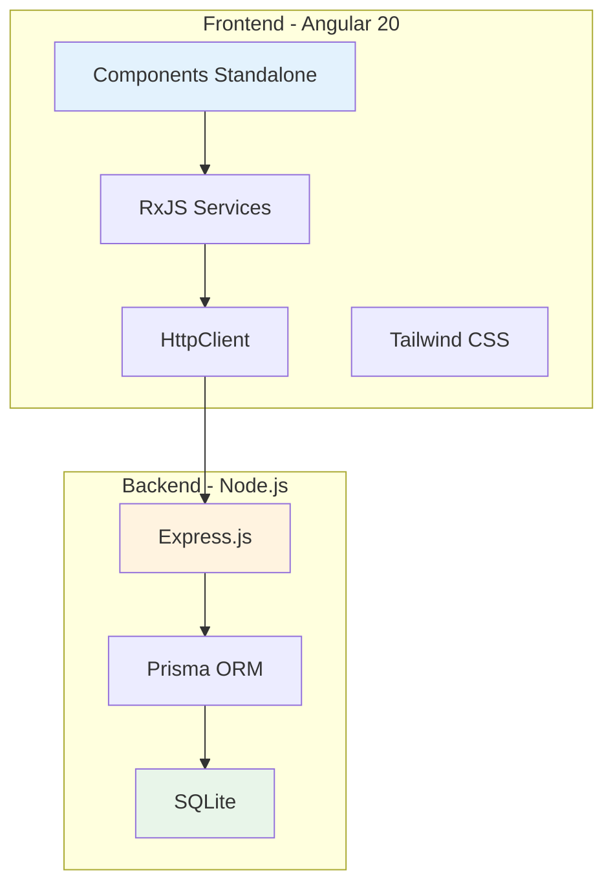

---

## Architecture Système

### Architecture Globale

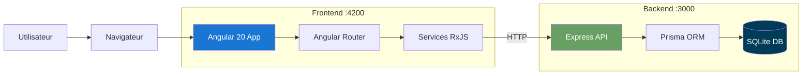

### Layers d'Architecture

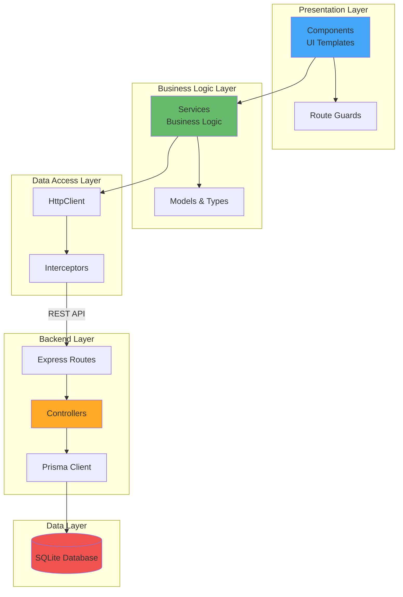

---

## Architecture Frontend

### Structure des Composants

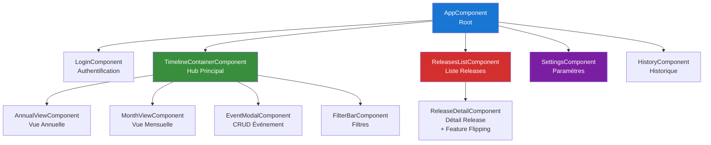

### Services et leur Responsabilité

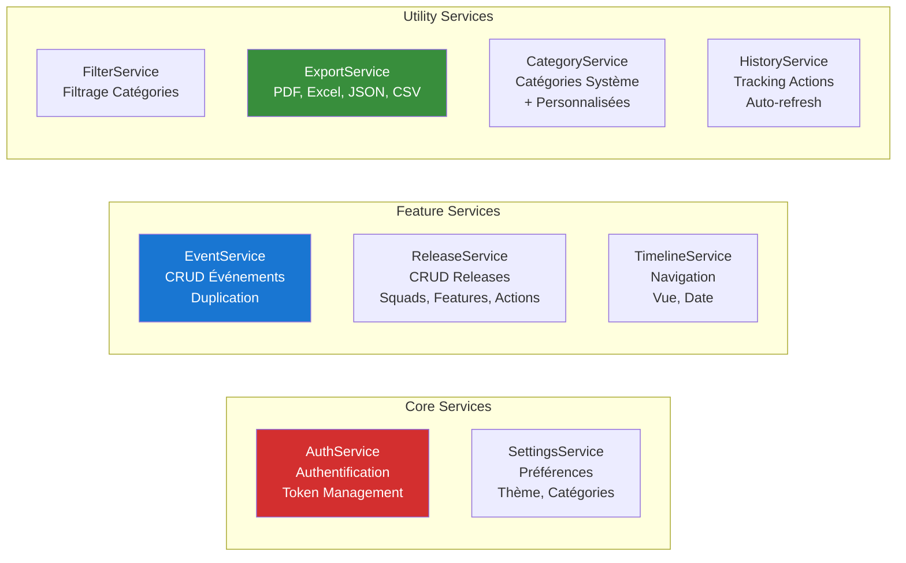

### Flux RxJS - State Management

```mermaid
graph TD
    subgraph "EventService"
        EventsBS[BehaviorSubject&lt;Event[]&gt;<br/>eventsSubject]
        EventsObs[Observable&lt;Event[]&gt;<br/>events$]
        LoadingBS[BehaviorSubject&lt;boolean&gt;<br/>loadingSubject]
        LoadingObs[Observable&lt;boolean&gt;<br/>loading$]
    end

    subgraph "Components"
        TimelineContainer[TimelineContainer]
        AnnualView[AnnualView]
        MonthView[MonthView]
    end

    EventsBS --> EventsObs
    LoadingBS --> LoadingObs

    EventsObs -->|subscribe + takeUntilDestroyed| TimelineContainer
    EventsObs -->|subscribe + takeUntilDestroyed| AnnualView
    EventsObs -->|subscribe + takeUntilDestroyed| MonthView

    TimelineContainer -->|createEvent| EventService
    EventService -->|next| EventsBS

    style EventsBS fill:#ff9800
    style EventsObs fill:#4caf50
```

---

## Architecture Backend

### Routes et Contrôleurs

```mermaid
graph LR
    Client[Client HTTP]

    subgraph "Express Router"
        EventRoutes[/api/events<br/>event.routes.js]
        ReleaseRoutes[/api/releases<br/>release.routes.js]
        SettingsRoutes[/api/settings<br/>settings.routes.js]
        HistoryRoutes[/api/history<br/>history.routes.js]
    end

    subgraph "Controllers"
        EventCtrl[EventController<br/>CRUD + Search]
        ReleaseCtrl[ReleaseController<br/>CRUD + Nested Entities]
        SettingsCtrl[SettingsController<br/>Get/Update Preferences]
        HistoryCtrl[HistoryController<br/>Track + Rollback]
    end

    subgraph "Prisma ORM"
        PrismaClient[Prisma Client<br/>Type-safe DB Access]
    end

    Client -->|POST /api/events| EventRoutes
    Client -->|GET /api/releases/:id| ReleaseRoutes
    Client -->|PUT /api/settings| SettingsRoutes
    Client -->|GET /api/history| HistoryRoutes

    EventRoutes --> EventCtrl
    ReleaseRoutes --> ReleaseCtrl
    SettingsRoutes --> SettingsCtrl
    HistoryRoutes --> HistoryCtrl

    EventCtrl --> PrismaClient
    ReleaseCtrl --> PrismaClient
    SettingsCtrl --> PrismaClient
    HistoryCtrl --> PrismaClient

    style EventRoutes fill:#1976d2,color:#fff
    style ReleaseRoutes fill:#388e3c,color:#fff
    style PrismaClient fill:#2d3748,color:#fff
```

### Modèle de Base de Données

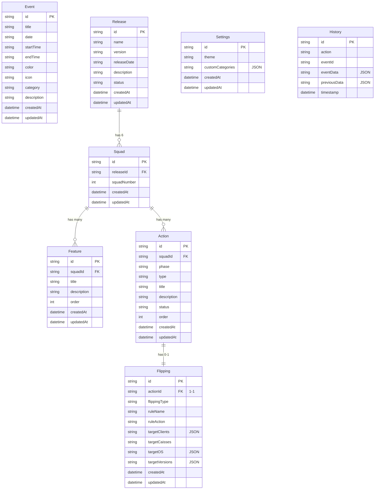

---

## Flux de Données

### Flux CRUD - Événements

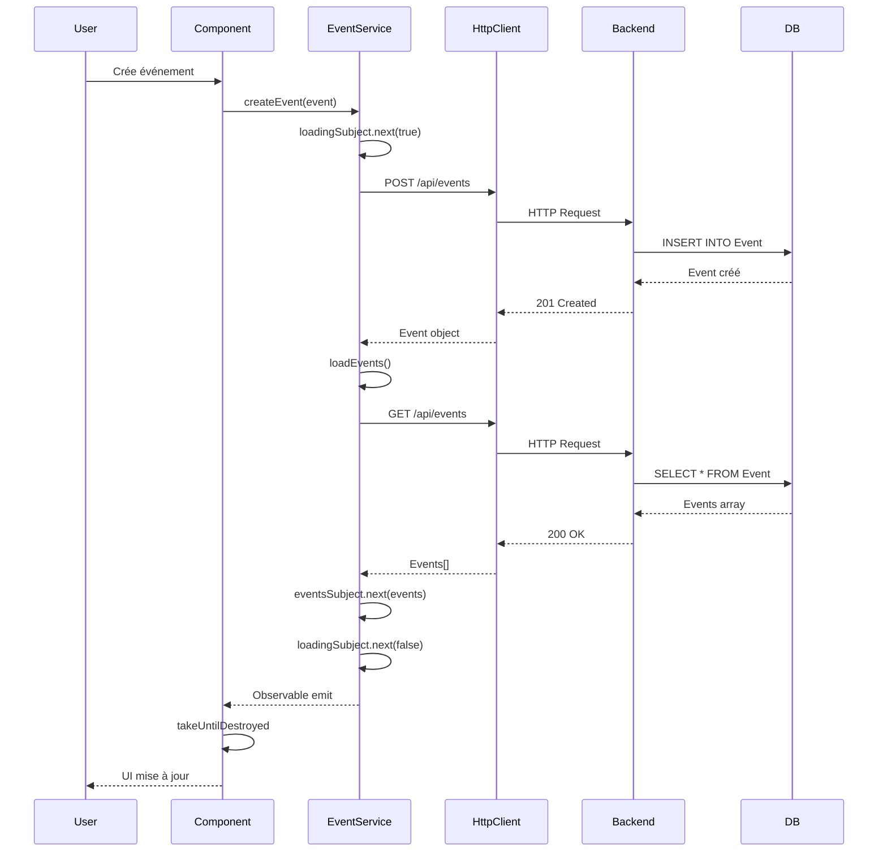

### Flux Feature Flipping - Release

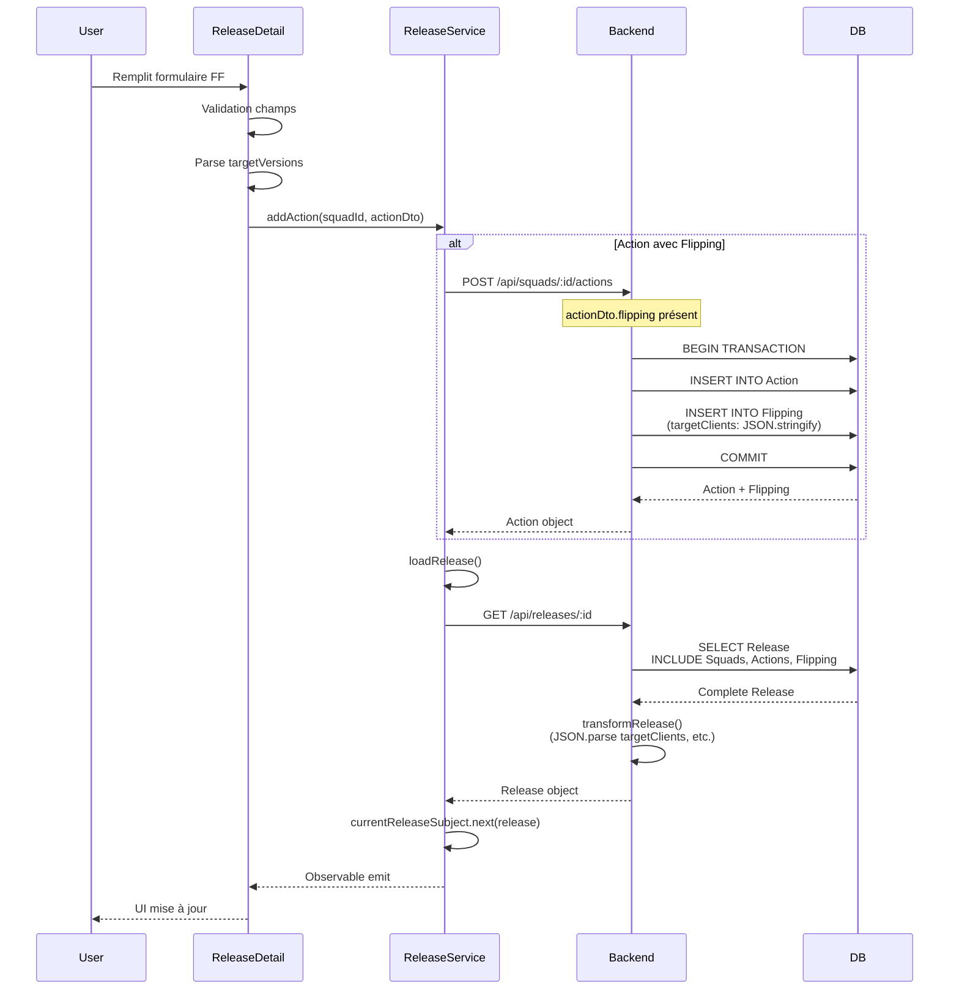

### Flux Authentification

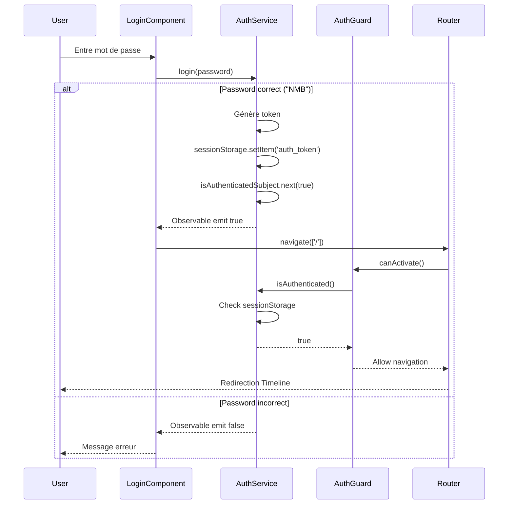

---

## Modèles de Données

### Event Model

```typescript
interface Event {
  id?: string;
  title: string;              // Requis
  date: string;               // ISO YYYY-MM-DD
  startTime?: string;         // HH:mm
  endTime?: string;           // HH:mm
  color: string;              // Hex #RRGGBB
  icon: string;               // Material Icons name
  category: EventCategory;    // Type prédéfini
  description?: string;
  createdAt: string;
}

type EventCategory =
  | 'mep'           // Mise en production
  | 'hotfix'
  | 'maintenance'
  | 'pi_planning'
  | 'sprint_start'
  | 'code_freeze'
  | 'psi'
  | 'other';
```

### Release Model

```typescript
interface Release {
  id?: string;
  name: string;               // Ex: "Release Q1 2024"
  version: string;            // Ex: "40.5"
  releaseDate: string;        // ISO date
  description?: string;
  status: ReleaseStatus;      // planned | in_progress | completed | cancelled
  squads: Squad[];            // Toujours 6 squads
  createdAt: string;
  updatedAt: string;
}

interface Squad {
  id?: string;
  releaseId: string;
  squadNumber: number;        // 1-6
  features: Feature[];
  actions: Action[];
  createdAt: string;
  updatedAt: string;
}

interface Action {
  id?: string;
  squadId: string;
  phase: ActionPhase;         // pre_mep | post_mep
  type: ActionType;
  title: string;
  description?: string;
  status: ActionStatus;       // pending | completed
  order: number;
  flipping?: Flipping;        // Optionnel, si type === feature_flipping || memory_flipping
  createdAt: string;
  updatedAt: string;
}
```

### Flipping Model

```typescript
interface Flipping {
  id?: string;
  actionId: string;
  flippingType: FlippingType;        // feature_flipping | memory_flipping
  ruleName: string;                  // Ex: "FEATURE_NEW_DASHBOARD"
  ruleAction: RuleAction;            // create_rule | obsolete_rule | disable_rule | enable_rule
  targetClients: string[];           // ["all"] ou ["891234567", "898765432"]
  targetCaisses?: string;            // "Caisse 1, Caisse 2" ou undefined (= toutes)
  targetOS: OSType[];                // ["ios", "android"] ou ["ios"] ou []
  targetVersions: VersionCondition[]; // [{ operator: ">=", version: "40.0" }] ou []
  createdAt: string;
  updatedAt: string;
}

interface VersionCondition {
  operator: VersionOperator;   // ">=" | "<=" | ">" | "<" | "=" | "!="
  version: string;             // "40.5"
}
```

---

## Diagrammes de Séquence

### Création d'un Événement

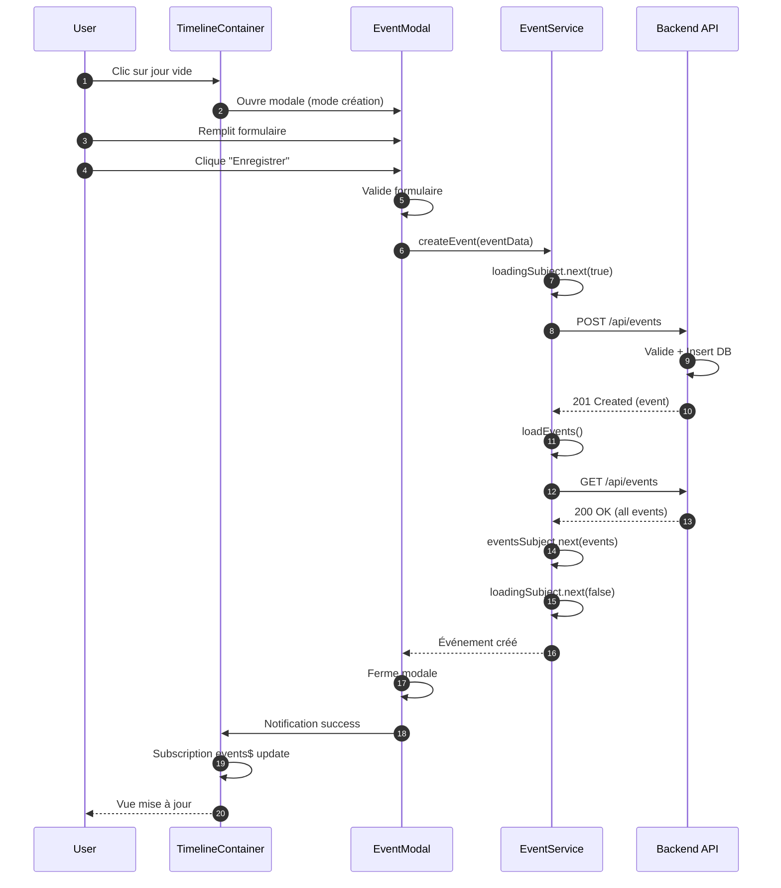

### Export PDF

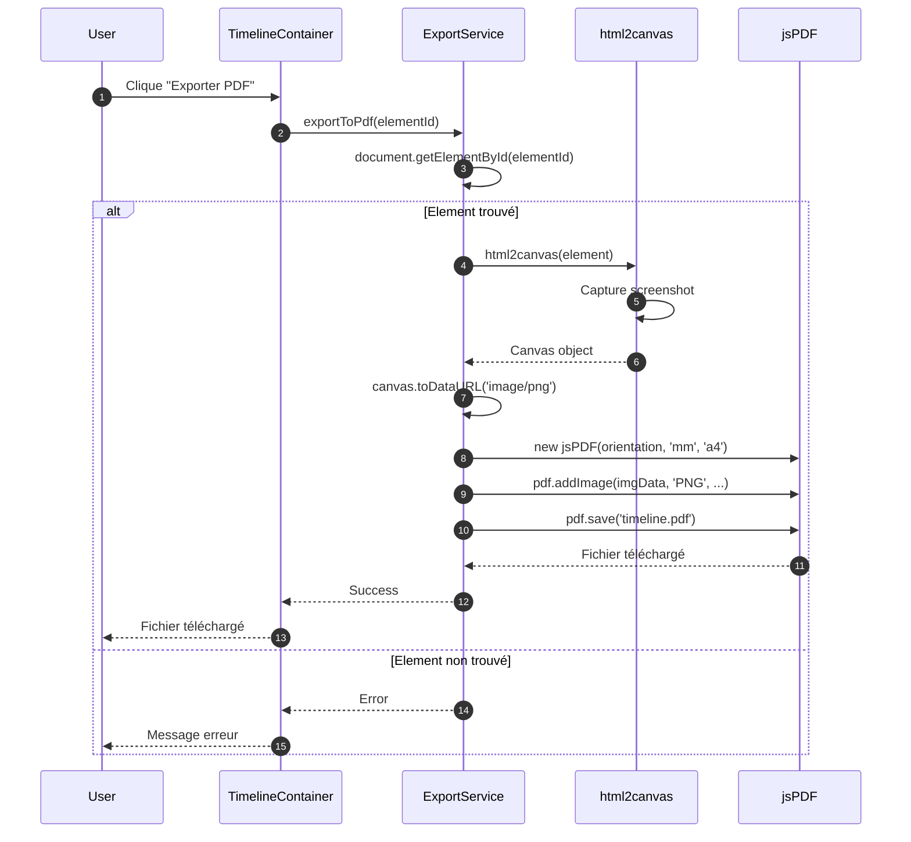

### Navigation Timeline avec Filtres

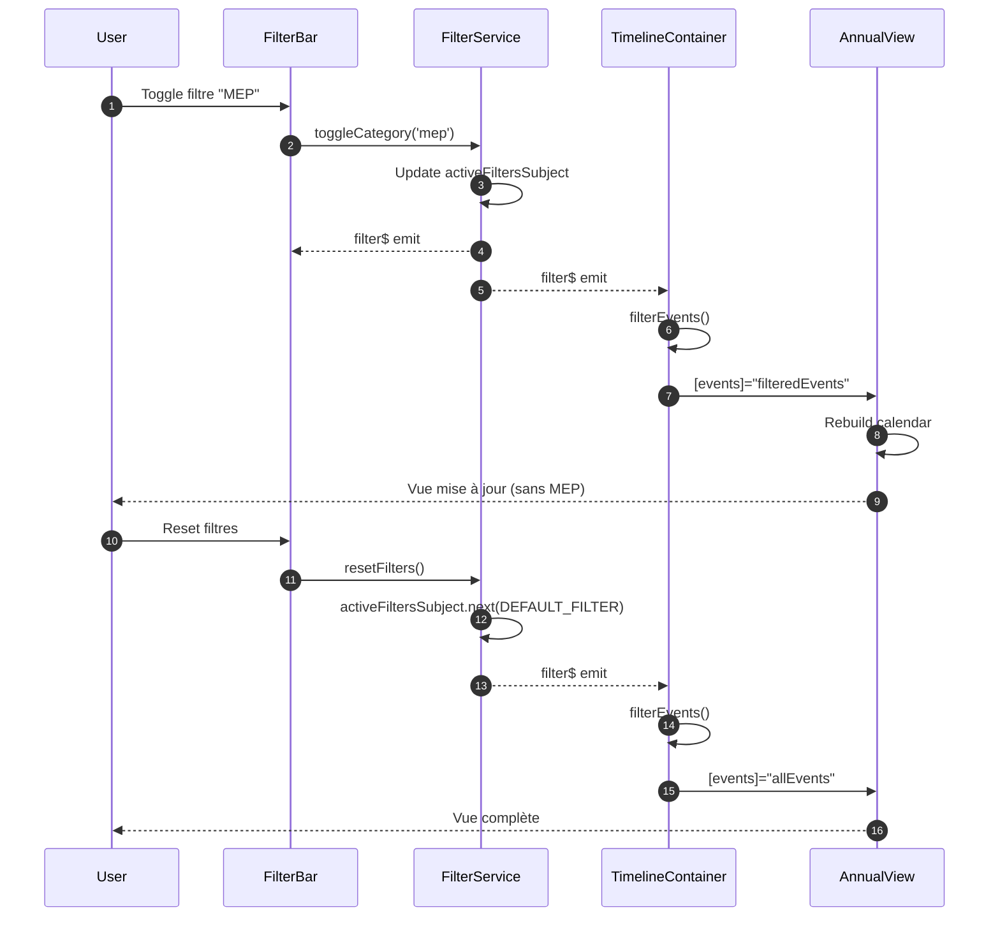

---

## Guide de Débogage

### Problèmes Courants

#### 1. Memory Leaks - Subscriptions

**Symptôme**: Application ralentit avec le temps, consommation mémoire augmente

**Diagnostic**:
```typescript
// ❌ MAUVAIS - Leak
ngOnInit() {
  this.eventService.events$.subscribe(events => {
    this.events = events;
  });
}

// ✅ BON - Pas de leak
import { takeUntilDestroyed } from '@angular/core/rxjs-interop';

constructor(private eventService: EventService) {
  this.eventService.events$
    .pipe(takeUntilDestroyed())
    .subscribe(events => {
      this.events = events;
    });
}
```

**Vérification**:
```bash
# Chrome DevTools
1. Ouvrir Performance Monitor
2. Naviguer dans l'app (changements de routes)
3. Observer "JS Heap Size" - ne doit pas augmenter indéfiniment
```

#### 2. Auto-refresh Non Arrêté

**Symptôme**: Appels API continuent après fermeture composant

**Solution**:
```typescript
export class HistoryService implements OnDestroy {
  private refreshIntervalId?: number;

  ngOnDestroy(): void {
    this.stopAutoRefresh();
  }

  private stopAutoRefresh(): void {
    if (this.refreshIntervalId) {
      window.clearInterval(this.refreshIntervalId);
      this.refreshIntervalId = undefined;
    }
  }
}
```

#### 3. Erreurs TypeScript après Modifications

**Symptôme**: Compilation échoue avec erreurs TypeScript

**Diagnostic**:
```bash
# Nettoyer cache Angular
cd event-planning-app
rm -rf .angular node_modules/.cache
npm start
```

#### 4. Feature Flipping - Données Non Affichées

**Symptôme**: Après ajout action FF, les données ne s'affichent pas

**Diagnostic**:
```typescript
// Vérifier que loadRelease() est appelé après ajout
async addAction(squadId: string, actionDto: CreateActionDto) {
  await this.http.post(...).toPromise();

  // CRITIQUE: Recharger la release
  if (this.currentReleaseSubject.value) {
    await this.getRelease(this.currentReleaseSubject.value.id!);
  }
}
```

**Vérifier JSON parsing backend**:
```javascript
// backend - release.controller.js
const transformRelease = (release) => ({
  ...release,
  squads: release.squads.map(squad => ({
    ...squad,
    actions: squad.actions.map(action => ({
      ...action,
      flipping: action.flipping ? {
        ...action.flipping,
        // CRITIQUE: Parser les champs JSON
        targetClients: JSON.parse(action.flipping.targetClients || '[]'),
        targetOS: JSON.parse(action.flipping.targetOS || '[]'),
        targetVersions: JSON.parse(action.flipping.targetVersions || '[]')
      } : undefined
    }))
  }))
});
```

### Outils de Débogage

#### Angular DevTools

```bash
# Installation
chrome://extensions/
# Rechercher "Angular DevTools"
```

**Utilisation**:
- **Component Explorer**: Inspecter état composants
- **Profiler**: Mesurer change detection
- **Injector Tree**: Visualiser injection dépendances

#### Network Monitoring

```javascript
// Ajouter dans app.config.ts pour debug HTTP
import { provideHttpClient, withInterceptors } from '@angular/common/http';

export const appConfig: ApplicationConfig = {
  providers: [
    provideHttpClient(
      withInterceptors([
        (req, next) => {
          console.log('HTTP Request:', req.method, req.url);
          return next(req).pipe(
            tap(event => {
              if (event.type === HttpEventType.Response) {
                console.log('HTTP Response:', event.status, event.body);
              }
            })
          );
        }
      ])
    )
  ]
};
```

#### Database Inspection

```bash
# Prisma Studio
cd event-planning-backend
npx prisma studio
# Ouvre http://localhost:5555
```

### Performance Profiling

#### Bundle Size Analysis

```bash
cd event-planning-app
npm run build -- --stats-json
npx webpack-bundle-analyzer dist/stats.json
```

#### Runtime Performance

```typescript
// Mesurer temps de chargement
ngOnInit() {
  const start = performance.now();

  this.loadData().then(() => {
    const end = performance.now();
    console.log(`Load time: ${end - start}ms`);
  });
}
```

#### Memory Profiling

```javascript
// Chrome DevTools > Memory
1. Prendre snapshot initial
2. Naviguer dans l'app (10-20 navigations)
3. Forcer garbage collection (icône poubelle)
4. Prendre snapshot final
5. Comparer snapshots - chercher "Detached HTMLElement"
```

---

## Bonnes Pratiques Implémentées

### ✅ Angular Best Practices

1. **Standalone Components**: Tous les composants sont standalone
2. **takeUntilDestroyed()**: Toutes les subscriptions sont nettoyées
3. **OnPush Change Detection**: Préparé pour optimisation future
4. **Lazy Loading**: Routes chargées à la demande
5. **Type Safety**: TypeScript strict activé

### ✅ Backend Best Practices

1. **Prisma ORM**: Protection injection SQL native
2. **Transaction Support**: Operations multi-tables atomiques
3. **Error Handling**: Gestion centralisée des erreurs
4. **CORS Configuration**: Configuré pour dev/prod
5. **Validation Input**: Validation des données entrantes

### ✅ Code Quality

1. **No Console.log in Production**: Supprimés
2. **No Dead Code**: Code mort supprimé
3. **No Memory Leaks**: Subscriptions nettoyées
4. **Consistent Naming**: Conventions respectées
5. **Documentation**: Code commenté où nécessaire

---

## Prochaines Étapes Recommandées

### Court Terme (Semaine 1-2)

1. **Tests Unitaires** - Atteindre 30% coverage (Phase 1 du plan de tests)
2. **ESLint Configuration** - Règles pour détecter memory leaks
3. **CI/CD Pipeline** - Automated testing & deployment

### Moyen Terme (Mois 1-2)

4. **Tests E2E** - Cypress/Playwright pour parcours critiques
5. **Logging Service** - Remplacement console.log
6. **Error Monitoring** - Intégration Sentry
7. **Performance Monitoring** - Métriques temps réel

### Long Terme (Trimestre 1-2)

8. **Authentification API** - Remplacement password en dur
9. **Multi-tenancy** - Support multi-équipes
10. **PWA** - Support offline avec Service Workers
11. **Internationalization** - Support multi-langues

---

## Support et Ressources

### Documentation Officielle

- [Angular 20](https://angular.dev)
- [RxJS](https://rxjs.dev)
- [Prisma](https://www.prisma.io/docs)
- [Tailwind CSS](https://tailwindcss.com)

### Commandes Utiles

```bash
# Frontend
cd event-planning-app
npm start                      # Dev server
npm run build                  # Production build
npm test                       # Unit tests
ng generate component name     # Nouveau composant

# Backend
cd event-planning-backend
npm run dev                    # Dev server avec nodemon
npm start                      # Production server
npx prisma db push             # Sync schema
npx prisma studio              # Database UI
npx prisma migrate dev         # Create migration

# Database
sqlite3 event-planning-backend/prisma/dev.db
.tables                        # Liste tables
.schema Event                  # Schema table
SELECT * FROM Event LIMIT 10;  # Query
.quit                          # Exit
```

---

**Dernière mise à jour**: 30 Novembre 2025
**Version de l'application**: 1.0.0
**Auteur**: Équipe DSI
