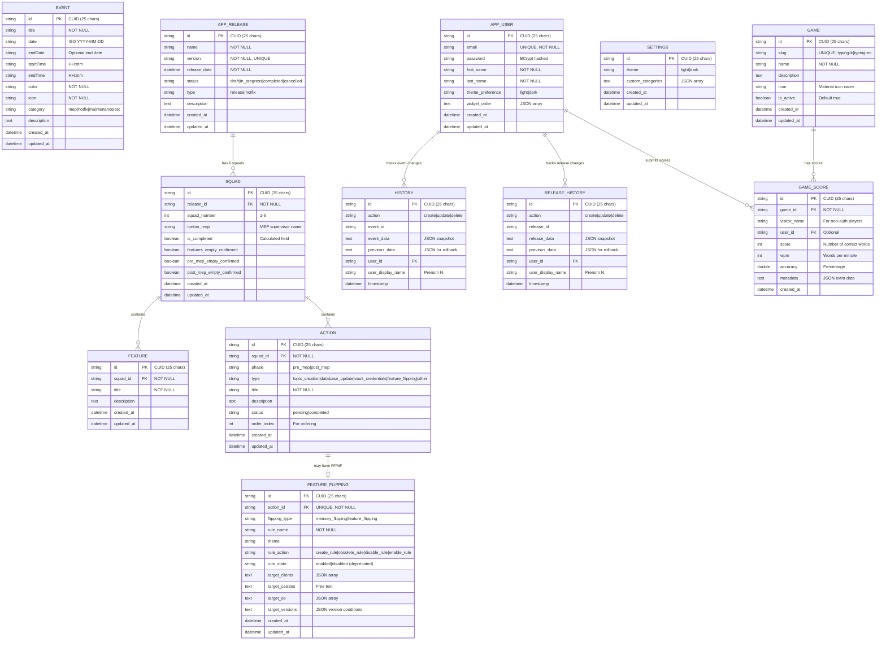

# Ma Banque Tools - Guide Technique Essentiel

## Vue d'ensemble
Application Angular 20 + Spring Boot pour la DSI d'une banque.
- **Modules**: Calendrier (Timeline trimestrielle), Préparation des MEP (Squads, Features, Actions FF/MF)

## Stack Technique
- **Frontend**: Angular 20 standalone, Tailwind CSS, Material Icons, date-fns, RxJS. Port: :4200
- **Backend**: Java 25, Spring Boot 3.5.0, Spring Data JPA, MySQL. Port: :3000

## Architecture Rapide
### Composants Clés
```
components/
├── auth/login.component.ts                  # Auth simple (password: "NMB")
├── filters/filter-bar.component.ts          # Filtres par catégorie uniquement
├── home/home.component.ts                   # Page accueil avec nav Calendrier/Prépa MEP
├── modals/event-modal.component.ts          # Formulaire événements
├── releases/
│   ├── releases-list.component.ts           # Liste + Export Markdown/HTML
│   ├── release-detail.component.ts          # Détail avec squads (accordéon)
│   ├── feature-form.component.ts            # Formulaire features
│   └── action-form.component.ts             # Formulaire actions FF/MF
├── settings/settings.component.ts           # Thème + catégories custom
└── timeline/
    ├── quarterly-view.component.ts          # Vue trimestrielle (3 mois)
    └── timeline-container.component.ts      # Conteneur principal
layouts/
└── main-layout.component.ts                 # Layout principal avec sidebar
services/
├── event.service.ts, release.service.ts     # CRUD
├── settings.service.ts, filter.service.ts   # Prefs & Filtres
├── timeline.service.ts                      # Nav
└── toast.service.ts                         # Notifications
```

### Backend (Spring Boot)
```
event-planning-spring-boot/event-planning-api/src/main/java/com/catsbanque/eventplanning/
├── MaBanqueToolsApiApplication.java       # Point d'entrée Spring Boot
├── config/
│   ├── CorsConfig.java                    # Configuration CORS
│   └── SecurityConfig.java                # Spring Security (JWT)
├── controller/
│   ├── EventController.java               # REST endpoints events
│   ├── ReleaseController.java             # REST endpoints releases
│   ├── SettingsController.java            # REST endpoints settings
│   ├── AuthController.java                # Authentification
│   ├── AdminController.java               # Gestion admin (users, stats, export/import)
│   ├── HistoryController.java             # Historique événements
│   ├── ReleaseHistoryController.java      # Historique releases
│   ├── GameController.java                # Jeu (Snake)
│   └── HealthController.java              # Health check
├── service/
│   ├── EventService.java                  # Logique métier events
│   ├── ReleaseService.java                # Logique métier releases
│   ├── SettingsService.java               # Logique métier settings
│   ├── AuthService.java                   # Auth & JWT
│   ├── AdminService.java                  # Admin operations
│   ├── HistoryService.java                # Historique events
│   ├── ReleaseHistoryService.java         # Historique releases
│   └── GameService.java                   # Logique jeu
├── repository/
│   ├── EventRepository.java               # JPA Repository (Spring Data)
│   ├── ReleaseRepository.java
│   ├── SquadRepository.java
│   ├── FeatureRepository.java
│   ├── ActionRepository.java
│   ├── FeatureFlippingRepository.java
│   ├── SettingsRepository.java
│   ├── UserRepository.java
│   ├── HistoryRepository.java
│   ├── ReleaseHistoryRepository.java
│   ├── GameRepository.java
│   └── GameScoreRepository.java
├── entity/
│   ├── Event.java                         # Entité JPA (@Entity)
│   ├── Release.java                       # Relations @OneToMany avec Squad
│   ├── Squad.java                         # Relations @ManyToOne/@OneToMany
│   ├── Feature.java
│   ├── Action.java
│   ├── FeatureFlipping.java              # @OneToOne avec Action
│   ├── Settings.java
│   ├── User.java                          # Auth utilisateurs
│   ├── History.java
│   ├── ReleaseHistory.java
│   ├── Game.java
│   └── GameScore.java
├── dto/
│   ├── EventDto.java                      # Data Transfer Objects
│   ├── ReleaseDto.java
│   ├── SquadDto.java
│   ├── FeatureDto.java
│   ├── ActionDto.java
│   ├── FeatureFlippingDto.java
│   ├── SettingsDto.java
│   ├── AuthResponse.java
│   ├── LoginRequest.java
│   ├── RegisterRequest.java
│   ├── AdminUserDto.java
│   ├── DatabaseExportDto.java
│   └── ...
└── util/
    ├── TokenUtil.java                     # Gestion JWT
    └── ...

resources/
└── application.properties                 # Configuration (MySQL, JPA, Security)
```

## Schéma de Base de Données (MySQL)



### Notes sur le schéma
- **IDs**: Tous les IDs utilisent le format CUID (ex: `cmj0ml2y2dfwpa1`) généré via `generateCuid()` dans `@PrePersist`
- **Cascade**: Relations `@OneToMany` avec `CascadeType.ALL` et `orphanRemoval = true`
- **Lazy Loading**: Résolu via `@Query` avec `LEFT JOIN FETCH` dans les repositories
- **Indexes**: Définis sur les FK et champs fréquemment filtrés (date, category, status, etc.)
- **JSON Storage**: Certains champs (custom_categories, widget_order, targets) stockés en TEXT/JSON

## Modèles Essentiels
### Event
```typescript
interface Event {
  id?: string; title: string; date: string; // ISO YYYY-MM-DD
  startTime?: string; endTime?: string; color: string; icon: string;
  category: EventCategory; description?: string;
}
type EventCategory = 'mep' | 'hotfix' | 'maintenance' | 'pi_planning' | 'sprint_start' | 'code_freeze' | 'psi' | 'other';
```

### Release / Squad / Feature / Action
```typescript
interface Release {
  id?: string; name: string; description?: string; releaseDate: string; // ISO YYYY-MM-DD
  status: 'draft' | 'active' | 'completed'; squads: Squad[];
}
interface Squad {
  id?: string; releaseId?: string; squadNumber: number; tontonMep?: string;
  features: Feature[]; actions: Action[]; isCompleted: boolean; // Calculé
}
interface Feature { id?: string; squadId?: string; title: string; description?: string; }
interface Action {
  id?: string; squadId?: string; title: string; description?: string;
  isCompleted: boolean; phase: 'pre_mep' | 'post_mep'; flipping?: FeatureFlipping;
}
interface FeatureFlipping {
  flippingType: 'feature_flipping' | 'memory_flipping'; ruleName: string;
  ruleAction: 'create_rule' | 'obsolete_rule' | 'disable_rule' | 'enable_rule';
  targetClients: string; targetCaisses?: string; targetOS: string; targetVersions: string;
}
```

## API Endpoints (Spring Boot REST)
```
Base URL: http://localhost:3000/api

# Events
GET    /api/events                    # Liste événements (filtres: category, dateFrom, dateTo, search)
GET    /api/events/{id}               # Détail événement
POST   /api/events                    # Créer événement
PUT    /api/events/{id}               # Modifier événement
DELETE /api/events/{id}               # Supprimer événement

# Releases
GET    /api/releases                  # Liste releases (futures + 20 dernières passées)
GET    /api/releases/{id}             # Détail release (id ou version)
POST   /api/releases                  # Créer release
PUT    /api/releases/{id}             # Modifier release
DELETE /api/releases/{id}             # Supprimer release
PATCH  /api/releases/{id}/actions/{actionId}/toggle  # Toggle action completion

# Settings
GET    /api/settings                  # Récupérer paramètres (theme, customCategories)
PUT    /api/settings                  # Mettre à jour paramètres

# Auth (JWT)
POST   /api/auth/login                # Login (username, password) → JWT token
POST   /api/auth/register             # Inscription
GET    /api/auth/me                   # User courant (JWT required)

# Admin (JWT required, ROLE_ADMIN)
GET    /api/admin/users               # Liste utilisateurs
DELETE /api/admin/users/{id}          # Supprimer utilisateur
GET    /api/admin/stats               # Statistiques
GET    /api/admin/export              # Export DB (JSON)
POST   /api/admin/import              # Import DB (JSON)

# History
GET    /api/history/events            # Historique événements
GET    /api/history/releases          # Historique releases

# Game (Snake)
POST   /api/game/submit-score         # Soumettre score
GET    /api/game/leaderboard          # Classement
GET    /api/game/my-scores            # Mes scores (JWT required)

# Health
GET    /api/health                    # Health check
```

## Design System
### Palette & Classes
- **Primary**: Vert émeraude (#10b981). **Alert**: Amber doux (#f59e0b). **Dark**: `bg-gray-800`.
- **Gradients**: `bg-gradient-planning`, `bg-gradient-releases`.
- **Classes**: `.card` (bg-gray-50/900), `.card-releases` (bg-white/800), `.btn-primary`.
- **UI**: Filter bar sticky, Export dropdown z-50, Date MEP neutre.

## Fonctionnalités Clés
### Calendrier
- **Timeline trimestrielle**: Affiche 3 mois (T1-T4) en colonne verticale.
- **Navigation**: Boutons Précédent/Suivant (±3 mois), "Aujourd'hui", flèches clavier.
- **Jours fériés**: Grisés automatiquement (week-ends + fériés français).
- **Scroll depuis Accueil**: Navigation automatique vers le trimestre d'un événement.
- **Filtres**: Catégorie uniquement. Semaine commence Lundi.
- **Catégories custom**: 8 colonnes, JSON.

### Préparation des MEP
- **Export**: Markdown/HTML avec détails FF/MF.
- **Squads**: Accordéon, indicateurs visuels (Vert/Amber).
- **Actions**: Pre/Post MEP, toggle.
- **FF/MF**: Clients, Caisses, OS, Versions.

## Points Techniques

### Frontend (Angular)
- **TimelineView**: Type unique `'quarter'` (Vue trimestrielle).
- **Navigation trimestrielle**: `nextPeriod()` / `previousPeriod()` avancent/reculent de 3 mois.
- **Jours fériés**: Algorithme Computus pour Pâques + fériés fixes français.
- **Scroll**: `Subject` (pas BehaviorSubject) pour `scrollToToday$`.
- **Dark Mode**: Classe `.dark` sur `html`.
- **Squad Complete**: `squad.actions.every(a => a.isCompleted)`.

### Backend (Spring Boot)
- **JPA Entities**: Relations bidirectionnelles `@OneToMany` / `@ManyToOne` avec cascade `CascadeType.ALL`.
- **DTOs**: Mapping manuel Entity ↔ DTO dans les services (pas de MapStruct).
- **Spring Security**: JWT token-based auth. Header: `Authorization: Bearer <token>`.
- **Roles**: `ROLE_USER` (défaut), `ROLE_ADMIN` (gestion users, export/import).
- **MySQL**: Base de données production. H2 pour tests (`@DataJpaTest`).
- **Validation**: `@Valid` sur les `@RequestBody`, annotations Jakarta Bean Validation.
- **CORS**: Configuré pour permettre Angular (localhost:4200).
- **Lombok**: `@Data`, `@Builder`, `@NoArgsConstructor`, `@AllArgsConstructor` sur entities/DTOs.
- **Tests**: JUnit 5, MockMvc pour integration tests, `@SpringBootTest` / `@DataJpaTest`.

## Scripts & Démarrage

### Frontend (Angular)
```bash
cd event-planning-app
npm install
npm start           # Démarre sur http://localhost:4200
```

### Backend (Spring Boot)
```bash
cd event-planning-spring-boot/event-planning-api

# Prérequis: MySQL installé et démarré
# Créer DB: eventplanning, user: eventplanning, password: eventplanning123

# Avec Maven Wrapper
./mvnw clean install          # Build & tests
./mvnw spring-boot:run        # Démarre sur http://localhost:3000/api

# Ou avec Maven
mvn clean install
mvn spring-boot:run

# Tests uniquement
./mvnw test
```

### Configuration MySQL
```sql
CREATE DATABASE eventplanning CHARACTER SET utf8mb4 COLLATE utf8mb4_unicode_ci;
CREATE USER 'eventplanning'@'localhost' IDENTIFIED BY 'eventplanning123';
GRANT ALL PRIVILEGES ON eventplanning.* TO 'eventplanning'@'localhost';
FLUSH PRIVILEGES;
```

### Variables d'environnement (application.properties)
```properties
server.port=3000
spring.datasource.url=jdbc:mysql://localhost:3306/eventplanning
spring.datasource.username=eventplanning
spring.datasource.password=eventplanning123
spring.jpa.hibernate.ddl-auto=update
```

## Updates & Historique
- **Dec 2024 Updates**:
  - Renommé "Ma Banque Tools", Design unifié, Dark mode adouci, Export détaillé.
  - **Vue trimestrielle** (Dec 6): Fusion annuelle/mensuelle → Vue unique 3 mois en colonne.
  - Jours fériés grisés (sans badge), navigation T1-T4, scroll auto depuis Accueil.
  - **Renommage** (Dec 7): Planning → Calendrier (route: /calendar), Dashboard → Accueil (route: /home), Releases → Préparation des MEP (affichage uniquement).
  - **Migration Spring Boot** (Dec 10): Backend migré de Node.js/Express/Prisma/SQLite vers Java 25/Spring Boot 3.5.0/JPA/MySQL.
    - Architecture: Controller → Service → Repository (JPA).
    - Authentification: Spring Security + JWT.
    - Nouvelles fonctionnalités: Admin panel, Historique, Jeu Snake, Export/Import DB.
- **Auth**: JWT token-based (remplace password "NMB").
- **Version**: Incluse dans nom release.
- **Cascade**: JPA cascade delete sur relations @OneToMany.

---
**Équipe**: DSI Banque | **Stack**: Angular 20 + Spring Boot 3.5.0 + MySQL | **Auth**: JWT
