# Ma Banque Tools - Guide Technique Essentiel

## Vue d'ensemble
Application Angular 20 + Spring Boot pour la DSI d'une banque.
- **Modules**: Calendrier (Timeline trimestrielle), Préparation des MEP (Squads, Features, Actions FF/MF), Release Notes (Gestion microservices par Squad)

## Stack Technique
- **Frontend**: Angular 20 standalone, Tailwind CSS, Material Icons, date-fns, RxJS. Port: :4200
- **Backend**: Java 21, Spring Boot 3.5.0, Spring Data JPA, MySQL. Port: :3000

## Architecture Rapide
### Composants Clés
```
components/
├── auth/login.component.ts                  # Auth JWT (email/password)
├── filters/filter-bar.component.ts          # Filtres par catégorie uniquement
├── home/home.component.ts                   # Page accueil avec nav Calendrier/Prépa MEP
├── modals/event-modal.component.ts          # Formulaire événements
├── releases/
│   ├── releases-list.component.ts           # Liste + Kebab menu (Modifier/Prépa MEP/Release Note)
│   ├── release-preparation.component.ts     # Prépa MEP avec squads (accordéon)
│   ├── feature-form.component.ts            # Formulaire features
│   ├── action-form.component.ts             # Formulaire actions FF/MF
│   └── release-note/
│       ├── release-note.component.ts        # Gestion Release Notes (table éditable)
│       ├── release-note-entry-modal.component.ts  # Modal gestion changes (Jira ID + description)
│       └── microservice-management-modal.component.ts  # ⚠️ Modal CRUD microservices
├── settings/settings.component.ts           # Thème + catégories custom
└── timeline/
    ├── quarterly-view.component.ts          # Vue trimestrielle (3 mois)
    └── timeline-container.component.ts      # Conteneur principal
layouts/
└── main-layout.component.ts                 # Layout principal avec sidebar (filtrage menu par permissions)
guards/
├── auth.guard.ts                            # Protection authentification globale
├── calendar.guard.ts                        # ⚠️ Protection routes CALENDAR (READ minimum requis)
├── releases.guard.ts                        # ⚠️ Protection routes RELEASES (READ minimum requis)
└── admin.guard.ts                           # ⚠️ Protection routes ADMIN (READ minimum requis)
directives/
└── has-permission.directive.ts              # ⚠️ Directive *hasPermission pour masquer éléments UI
interceptors/
└── auth.interceptor.ts                      # ⚠️ HTTP Interceptor (ajoute Authorization: Bearer <token>)
services/
├── event.service.ts, release.service.ts     # CRUD
├── release-note.service.ts                  # CRUD Release Notes + Export (Markdown/HTML)
├── microservice.service.ts                  # ⚠️ CRUD Microservices (référentiel pour Release Notes)
├── auth.service.ts                          # ⚠️ Login, logout, stockage token (sessionStorage)
├── permission.service.ts                    # ⚠️ Gestion permissions (hasReadAccess, hasWriteAccess)
├── settings.service.ts, filter.service.ts   # Prefs & Filtres
├── timeline.service.ts                      # Nav
└── toast.service.ts                         # Notifications
```

### Backend (Spring Boot)
```
mabanquetools-backend/mabanquetools-backend/src/main/java/com/catsbanque/mabanquetools/
├── MaBanqueToolsApiApplication.java       # Point d'entrée Spring Boot
├── config/
│   ├── CorsConfig.java                    # Configuration CORS
│   ├── SecurityConfig.java                # Spring Security (JWT, endpoints publics/protégés)
│   └── JwtAuthenticationFilter.java       # ⚠️ Filtre JWT + chargement permissions (CRITIQUE)
├── controller/
│   ├── EventController.java               # REST endpoints events (@PreAuthorize CALENDAR)
│   ├── ReleaseController.java             # REST endpoints releases (@PreAuthorize RELEASES)
│   ├── ReleaseNoteController.java         # REST endpoints release notes + export (@PreAuthorize RELEASES)
│   ├── MicroserviceController.java        # ⚠️ REST endpoints microservices (@PreAuthorize RELEASES)
│   ├── SettingsController.java            # REST endpoints settings
│   ├── AuthController.java                # Authentification (login, register, /me, preferences)
│   ├── PermissionController.java          # Gestion permissions (@PreAuthorize ADMIN)
│   ├── AdminController.java               # Gestion admin (users, stats, export/import)
│   ├── HistoryController.java             # Historique événements
│   ├── ReleaseHistoryController.java      # Historique releases
│   ├── GameController.java                # Jeu (Snake)
│   └── HealthController.java              # Health check
├── service/
│   ├── EventService.java                  # Logique métier events
│   ├── ReleaseService.java                # Logique métier releases
│   ├── ReleaseNoteService.java            # Logique métier release notes + export Markdown/HTML
│   ├── MicroserviceService.java           # ⚠️ Logique métier microservices + init référentiel par défaut
│   ├── SettingsService.java               # Logique métier settings
│   ├── AuthService.java                   # Auth & JWT (@PostConstruct admin par défaut)
│   ├── PermissionService.java             # ⚠️ Gestion permissions (getUserPermissions, setPermission)
│   ├── AdminService.java                  # Admin operations
│   ├── HistoryService.java                # Historique events
│   ├── ReleaseHistoryService.java         # Historique releases
│   └── GameService.java                   # Logique jeu
├── repository/
│   ├── EventRepository.java               # JPA Repository (Spring Data)
│   ├── ReleaseRepository.java
│   ├── ReleaseNoteEntryRepository.java    # Repository release notes avec tri Squad + deploy order
│   ├── MicroserviceRepository.java        # ⚠️ Repository microservices (findAllActive, findActiveBySquad)
│   ├── SquadRepository.java
│   ├── FeatureRepository.java
│   ├── ActionRepository.java
│   ├── FeatureFlippingRepository.java
│   ├── SettingsRepository.java
│   ├── UserRepository.java
│   ├── UserPermissionRepository.java      # ⚠️ Repository permissions
│   ├── HistoryRepository.java
│   ├── ReleaseHistoryRepository.java
│   ├── GameRepository.java
│   └── GameScoreRepository.java
├── entity/
│   ├── Event.java                         # Entité JPA (@Entity) - CUID generation
│   ├── Release.java                       # Relations @OneToMany avec Squad - CUID generation
│   ├── ReleaseNoteEntry.java              # Entrée release note (JSON changes + FK microservice) - CUID generation
│   ├── Microservice.java                  # ⚠️ Référentiel microservices (name, squad, solution, displayOrder, isActive)
│   ├── Squad.java                         # Relations @ManyToOne/@OneToMany - CUID generation
│   ├── Feature.java                       # CUID generation
│   ├── Action.java                        # CUID generation
│   ├── FeatureFlipping.java              # @OneToOne avec Action
│   ├── Settings.java
│   ├── User.java                          # Auth utilisateurs (email, password BCrypt)
│   ├── UserPermission.java                # ⚠️ Permissions (module ENUM, level ENUM)
│   ├── PermissionModule.java              # ⚠️ ENUM: CALENDAR, RELEASES, ADMIN
│   ├── PermissionLevel.java               # ⚠️ ENUM: NONE, READ, WRITE
│   ├── History.java
│   ├── ReleaseHistory.java
│   ├── Game.java
│   └── GameScore.java
├── dto/
│   ├── EventDto.java                      # Data Transfer Objects
│   ├── ReleaseDto.java
│   ├── SquadDto.java
│   ├── FeatureDto.java
│   ├── ActionDto.java
│   ├── FeatureFlippingDto.java
│   ├── SettingsDto.java
│   ├── UserDto.java                       # ⚠️ Contient Map<PermissionModule, PermissionLevel>
│   ├── AuthResponse.java                  # ⚠️ {token, user}
│   ├── LoginRequest.java
│   ├── RegisterRequest.java
│   ├── UpdatePreferencesRequest.java      # {themePreference}
│   ├── UpdatePreferencesResponse.java     # {message, user}
│   ├── UpdateWidgetOrderRequest.java      # {widgetOrder: List<String>}
│   ├── UpdatePermissionsRequest.java      # {permissions: Map<module, level>}
│   ├── UserPermissionsResponse.java       # Liste permissions utilisateurs
│   ├── UserPermissionDto.java
│   ├── AdminUserDto.java
│   ├── DatabaseExportDto.java
│   └── ...
└── util/
    ├── JwtUtil.java                       # ⚠️ Gestion JWT (generateToken, validateToken, getUserIdFromToken)
    └── ...

resources/
└── application.properties                 # Configuration (MySQL, JPA, Security, JWT secret)
```

## Authentification & Permissions

### Architecture de Sécurité

L'application utilise un système d'authentification JWT (JSON Web Token) couplé à un système de permissions granulaires par module.

#### Composants Clés

**Backend:**
- `JwtAuthenticationFilter.java` - Filtre Spring Security qui intercepte chaque requête HTTP, extrait et valide le JWT, charge les permissions de l'utilisateur
- `SecurityConfig.java` - Configuration Spring Security (endpoints publics/protégés, CORS, CSRF désactivé pour API REST)
- `JwtUtil.java` - Utilitaire pour générer et valider les tokens JWT (secret: `your-secret-key-change-this-in-production`, expiration: 24h)
- `PermissionService.java` - Gestion des permissions utilisateur
- `AuthService.java` - Logique métier auth (login, register, gestion préférences)
- `AuthController.java` - Endpoints REST d'authentification

**Frontend:**
- `auth.interceptor.ts` - HTTP Interceptor Angular qui ajoute automatiquement le header `Authorization: Bearer <token>` à toutes les requêtes API
- `auth.service.ts` - Service Angular pour login/logout, stockage token dans sessionStorage

#### Tables de Sécurité

```sql
-- Table des utilisateurs
CREATE TABLE app_user (
    id VARCHAR(25) PRIMARY KEY,              -- CUID
    email VARCHAR(255) UNIQUE NOT NULL,      -- Identifiant de connexion
    password VARCHAR(255) NOT NULL,          -- Hash BCrypt (cost 10)
    first_name VARCHAR(100) NOT NULL,
    last_name VARCHAR(100) NOT NULL,
    theme_preference VARCHAR(10),            -- 'light' ou 'dark'
    widget_order TEXT,                       -- JSON array pour personnalisation dashboard
    created_at DATETIME(6) NOT NULL,
    updated_at DATETIME(6) NOT NULL
);

-- Table des permissions utilisateur
CREATE TABLE user_permissions (
    id VARCHAR(25) PRIMARY KEY,              -- CUID
    user_id VARCHAR(25) NOT NULL,            -- FK vers app_user
    module ENUM('CALENDAR', 'RELEASES', 'ADMIN') NOT NULL,
    permission_level ENUM('NONE', 'READ', 'WRITE') NOT NULL,
    created_at DATETIME(6) NOT NULL,
    updated_at DATETIME(6) NOT NULL,
    FOREIGN KEY (user_id) REFERENCES app_user(id) ON DELETE CASCADE
);
```

#### Système de Permissions

**3 Modules:**
- `CALENDAR` - Gestion du calendrier des événements
- `RELEASES` - Gestion de la préparation des MEP (releases, squads, features, actions)
- `ADMIN` - Administration (gestion utilisateurs, stats, export/import DB)

**3 Niveaux:**
- `NONE` - Aucun accès (module masqué dans l'UI)
- `READ` - Lecture seule
- `WRITE` - Lecture + création/modification/suppression

**Mapping Spring Security:**
Les permissions sont converties en `GrantedAuthority` avec le format: `PERMISSION_{MODULE}_{LEVEL}`

Exemples:
- `PERMISSION_CALENDAR_WRITE` - Accès complet au calendrier
- `PERMISSION_RELEASES_READ` - Lecture seule des releases
- `PERMISSION_ADMIN_WRITE` - Accès admin complet

#### Flux d'Authentification

**1. Login (POST /api/auth/login)**

```
Frontend                    Backend                     Database
   |                           |                            |
   |-- {email, password} ----->|                            |
   |                           |-- SELECT user BY email --->|
   |                           |<-- User entity ------------|
   |                           |                            |
   |                           |-- Verify BCrypt password   |
   |                           |                            |
   |                           |-- SELECT permissions ----->|
   |                           |<-- Permissions list -------|
   |                           |                            |
   |                           |-- Generate JWT token       |
   |                           |   (userId, email, exp)     |
   |                           |                            |
   |<-- {token, user, perms}---|                            |
   |                           |                            |
   |-- Store in sessionStorage |                            |
```

**2. Requêtes Authentifiées**

```
Frontend                    Interceptor                 Backend Filter              Controller
   |                           |                            |                            |
   |-- GET /api/events ------->|                            |                            |
   |                           |-- Add Header:              |                            |
   |                           |   Authorization: Bearer... |                            |
   |                           |--------------------------->|                            |
   |                           |                            |-- Extract JWT              |
   |                           |                            |-- Validate signature       |
   |                           |                            |-- Check expiration         |
   |                           |                            |-- Load user permissions -->|
   |                           |                            |   from DB                  |
   |                           |                            |                            |
   |                           |                            |-- Create Authentication    |
   |                           |                            |   with GrantedAuthorities: |
   |                           |                            |   - PERMISSION_CALENDAR_WRITE
   |                           |                            |   - PERMISSION_RELEASES_WRITE
   |                           |                            |   - PERMISSION_ADMIN_WRITE
   |                           |                            |   - ROLE_USER              |
   |                           |                            |                            |
   |                           |                            |-- SecurityContext.set ----->|
   |                           |                            |                            |
   |                           |                            |                            |-- @PreAuthorize check
   |                           |                            |                            |   hasPermission(...)
   |                           |                            |                            |
   |                           |                            |<-- OK / 403 Forbidden ------|
```

**Code: JwtAuthenticationFilter.java**

```java
@Override
protected void doFilterInternal(HttpServletRequest request,
                                HttpServletResponse response,
                                FilterChain filterChain) {
    String token = extractToken(request);
    if (token != null && jwtUtil.validateToken(token)) {
        String userId = jwtUtil.getUserIdFromToken(token);

        // ⚠️ CRITIQUE: Charger les permissions depuis la DB
        List<GrantedAuthority> authorities = loadUserAuthorities(userId);

        UsernamePasswordAuthenticationToken authentication =
            new UsernamePasswordAuthenticationToken(userId, null, authorities);

        SecurityContextHolder.getContext().setAuthentication(authentication);
    }
    filterChain.doFilter(request, response);
}

private List<GrantedAuthority> loadUserAuthorities(String userId) {
    List<GrantedAuthority> authorities = new ArrayList<>();

    // Charger les permissions depuis la table user_permissions
    Map<PermissionModule, PermissionLevel> permissions =
        permissionService.getUserPermissions(userId);

    // Convertir en GrantedAuthority
    for (Map.Entry<PermissionModule, PermissionLevel> entry : permissions.entrySet()) {
        String authority = String.format("PERMISSION_%s_%s",
                                        entry.getKey().name(),
                                        entry.getValue().name());
        authorities.add(new SimpleGrantedAuthority(authority));
    }

    // Ajouter ROLE_USER pour tous les utilisateurs authentifiés
    authorities.add(new SimpleGrantedAuthority("ROLE_USER"));

    return authorities;
}
```

**Code: Controller avec @PreAuthorize**

```java
@RestController
@RequestMapping("/api/releases")
public class ReleaseController {

    // Lecture: Nécessite READ ou WRITE sur RELEASES
    @GetMapping
    @PreAuthorize("hasAnyAuthority('PERMISSION_RELEASES_READ', 'PERMISSION_RELEASES_WRITE')")
    public ResponseEntity<List<ReleaseDto>> getAllReleases() {
        // ...
    }

    // Création: Nécessite WRITE sur RELEASES
    @PostMapping
    @PreAuthorize("hasAuthority('PERMISSION_RELEASES_WRITE')")
    public ResponseEntity<ReleaseDto> createRelease(@Valid @RequestBody CreateReleaseRequest request) {
        // ...
    }

    // Admin: Nécessite WRITE sur ADMIN
    @DeleteMapping("/{id}")
    @PreAuthorize("hasAuthority('PERMISSION_ADMIN_WRITE')")
    public ResponseEntity<Void> deleteRelease(@PathVariable String id) {
        // ...
    }
}
```

#### Utilisateur Admin par Défaut

Au démarrage de l'application, un compte admin est automatiquement créé via `@PostConstruct`:

```java
@Service
public class AuthService {

    @PostConstruct
    public void initDefaultAdmin() {
        if (userRepository.findByEmail("admin").isPresent()) {
            return; // Admin existe déjà
        }

        // Créer l'admin
        User admin = User.builder()
            .email("admin")
            .password(passwordEncoder.encode("admin")) // BCrypt hash
            .firstName("Admin")
            .lastName("Système")
            .themePreference("light")
            .build();

        admin = userRepository.save(admin);

        // Donner WRITE sur tous les modules
        permissionService.setPermission(admin.getId(), PermissionModule.CALENDAR, PermissionLevel.WRITE);
        permissionService.setPermission(admin.getId(), PermissionModule.RELEASES, PermissionLevel.WRITE);
        permissionService.setPermission(admin.getId(), PermissionModule.ADMIN, PermissionLevel.WRITE);
    }
}
```

**Credentials Admin:**
- Email: `admin`
- Password: `admin`

#### Frontend - HTTP Interceptor

**Code: auth.interceptor.ts**

```typescript
export const authInterceptor: HttpInterceptorFn = (req, next) => {
  const token = sessionStorage.getItem('planning_auth_token');

  if (!token) {
    return next(req); // Pas de token → requête non authentifiée
  }

  // Cloner la requête et ajouter le header Authorization
  const authReq = req.clone({
    setHeaders: {
      Authorization: `Bearer ${token}`
    }
  });

  return next(authReq);
};
```

**Enregistrement dans main.ts:**

```typescript
bootstrapApplication(AppComponent, {
  providers: [
    provideHttpClient(
      withInterceptors([authInterceptor]) // ⚠️ Enregistrer l'intercepteur
    ),
    // ...
  ]
});
```

#### Endpoints d'Authentification

```bash
# Login
POST /api/auth/login
Body: { "email": "admin", "password": "admin" }
Response: {
  "token": "eyJhbGciOiJIUzI1NiJ9...",
  "user": {
    "id": "admin001",
    "email": "admin",
    "firstName": "Admin",
    "lastName": "Système",
    "themePreference": "light",
    "permissions": {
      "CALENDAR": "WRITE",
      "RELEASES": "WRITE",
      "ADMIN": "WRITE"
    }
  }
}

# Register (création compte)
POST /api/auth/register
Body: {
  "email": "user@example.com",
  "password": "password123",
  "firstName": "John",
  "lastName": "Doe"
}
Response: { "token": "...", "user": {...} }

# Get current user (JWT required)
GET /api/auth/me
Header: Authorization: Bearer <token>
Response: { "id": "...", "email": "...", "permissions": {...} }

# Update preferences (JWT required)
PUT /api/auth/preferences
Header: Authorization: Bearer <token>
Body: { "themePreference": "dark" }
Response: {
  "message": "Préférences mises à jour",
  "user": {...}
}

# Update widget order (JWT required)
PUT /api/auth/widget-order
Header: Authorization: Bearer <token>
Body: { "widgetOrder": ["widget1", "widget2", "widget3"] }
Response: {
  "message": "Ordre des widgets mis à jour",
  "user": {...}
}
```

#### Gestion des Permissions (Admin uniquement)

```bash
# Lister les permissions d'un utilisateur
GET /api/permissions/user/{userId}
Header: Authorization: Bearer <token>
Requires: PERMISSION_ADMIN_WRITE

# Mettre à jour les permissions
PUT /api/permissions/user/{userId}
Header: Authorization: Bearer <token>
Body: {
  "permissions": {
    "CALENDAR": "WRITE",
    "RELEASES": "READ",
    "ADMIN": "NONE"
  }
}
Requires: PERMISSION_ADMIN_WRITE
```

#### Sécurité

**Token JWT:**
- Algorithme: HS256 (HMAC with SHA-256)
- Secret: Défini dans `application.properties` (à changer en production!)
- Expiration: 24 heures
- Claims: userId, email, firstName, lastName, iat (issued at), exp (expiration)

**Mots de passe:**
- Hash: BCrypt
- Cost factor: 10 (2^10 = 1024 rounds)
- Salt: Généré automatiquement par BCrypt

**CORS:**
- Origin autorisé: `http://localhost:4200` (Angular dev server)
- Méthodes: GET, POST, PUT, DELETE, PATCH
- Headers: `Authorization`, `Content-Type`

**CSRF:**
- Désactivé pour l'API REST (stateless JWT auth)
- Activé uniquement si session-based auth

**Endpoints Publics:**
- `/api/auth/login`
- `/api/auth/register`
- `/api/health`

**Important:** Tous les autres endpoints nécessitent un JWT valide!

#### Dépannage Commun

**Erreur 403 Forbidden malgré connexion réussie:**
- ✅ Vérifier que le frontend envoie bien le header `Authorization: Bearer <token>`
- ✅ Vérifier que `authInterceptor` est enregistré dans `main.ts`
- ✅ Vérifier que `JwtAuthenticationFilter` charge bien les permissions depuis la DB (logs: "Authority ajoutée: PERMISSION_XXX_XXX")
- ✅ Vérifier que `@PreAuthorize` dans le controller correspond aux permissions de l'utilisateur

**Token expiré:**
- Le frontend doit détecter les erreurs 401 et rediriger vers `/login`
- Implémenter un refresh token si besoin de sessions longues

**Permissions non chargées:**
- Vérifier que la table `user_permissions` contient bien les entrées pour l'utilisateur
- Vérifier les logs Spring Boot: "Utilisateur authentifié via JWT: {userId} avec {N} authorities"

## Schéma de Base de Données (MySQL)

```mermaid
erDiagram
    %% Tables principales
    EVENT {
        string id PK "CUID (25 chars)"
        string title "NOT NULL"
        string date "ISO YYYY-MM-DD"
        string endDate "Optional end date"
        string startTime "HH:mm"
        string endTime "HH:mm"
        string color "NOT NULL"
        string icon "NOT NULL"
        string category "mep|hotfix|maintenance|etc"
        text description
        datetime created_at
        datetime updated_at
    }

    APP_RELEASE {
        string id PK "CUID (25 chars)"
        string name "NOT NULL"
        string version "NOT NULL, UNIQUE"
        datetime release_date "NOT NULL"
        string status "draft|in_progress|completed|cancelled"
        string type "release|hotfix"
        text description
        datetime created_at
        datetime updated_at
    }

    SQUAD {
        string id PK "CUID (25 chars)"
        string release_id FK "NOT NULL"
        int squad_number "1-6"
        string tonton_mep "MEP supervisor name"
        boolean is_completed "Calculated field"
        boolean features_empty_confirmed
        boolean pre_mep_empty_confirmed
        boolean post_mep_empty_confirmed
        datetime created_at
        datetime updated_at
    }

    FEATURE {
        string id PK "CUID (25 chars)"
        string squad_id FK "NOT NULL"
        string title "NOT NULL"
        text description
        datetime created_at
        datetime updated_at
    }

    ACTION {
        string id PK "CUID (25 chars)"
        string squad_id FK "NOT NULL"
        string phase "pre_mep|post_mep"
        string type "topic_creation|database_update|vault_credentials|feature_flipping|other"
        string title "NOT NULL"
        text description
        string status "pending|completed"
        int order_index "For ordering"
        datetime created_at
        datetime updated_at
    }

    FEATURE_FLIPPING {
        string id PK "CUID (25 chars)"
        string action_id FK "UNIQUE, NOT NULL"
        string flipping_type "memory_flipping|feature_flipping"
        string rule_name "NOT NULL"
        string theme
        string rule_action "create_rule|obsolete_rule|disable_rule|enable_rule"
        string rule_state "enabled|disabled (deprecated)"
        text target_clients "JSON array"
        text target_caisses "Free text"
        text target_os "JSON array"
        text target_versions "JSON version conditions"
        datetime created_at
        datetime updated_at
    }

    MICROSERVICE {
        string id PK "CUID (25 chars)"
        string name "UNIQUE, NOT NULL"
        string squad "Squad 1-6, NOT NULL"
        string solution "Solution name"
        int display_order "Display order"
        boolean is_active "Active/Inactive (soft delete)"
        text description
        datetime created_at
        datetime updated_at
    }

    RELEASE_NOTE_ENTRY {
        string id PK "CUID (25 chars)"
        string release_id FK "NOT NULL"
        string microservice_id FK "FK to microservice (preferred)"
        string microservice "Legacy: free text"
        string squad "Squad 1-6"
        boolean part_en_mep "Déployé en MEP?"
        int deploy_order "Ordre déploiement"
        string tag "Version tag"
        string parent_version "Version parent"
        json changes "Array of {jiraId, description}"
        datetime created_at
        datetime updated_at
    }

    APP_USER {
        string id PK "CUID (25 chars)"
        string email "UNIQUE, NOT NULL"
        string password "BCrypt hashed"
        string first_name "NOT NULL"
        string last_name "NOT NULL"
        string theme_preference "light|dark"
        text widget_order "JSON array"
        datetime created_at
        datetime updated_at
    }

    USER_PERMISSION {
        string id PK "CUID (25 chars)"
        string user_id FK "NOT NULL"
        enum module "CALENDAR|RELEASES|ADMIN"
        enum permission_level "NONE|READ|WRITE"
        datetime created_at
        datetime updated_at
    }

    SETTINGS {
        string id PK "CUID (25 chars)"
        string theme "light|dark"
        text custom_categories "JSON array"
        datetime created_at
        datetime updated_at
    }

    HISTORY {
        string id PK "CUID (25 chars)"
        string action "create|update|delete"
        string event_id
        text event_data "JSON snapshot"
        text previous_data "JSON for rollback"
        string user_id FK
        string user_display_name "Prenom N."
        datetime timestamp
    }

    RELEASE_HISTORY {
        string id PK "CUID (25 chars)"
        string action "create|update|delete"
        string release_id
        text release_data "JSON snapshot"
        text previous_data "JSON for rollback"
        string user_id FK
        string user_display_name "Prenom N."
        datetime timestamp
    }

    GAME {
        string id PK "CUID (25 chars)"
        string slug "UNIQUE, typing-fr|typing-en"
        string name "NOT NULL"
        text description
        string icon "Material icon name"
        boolean is_active "Default true"
        datetime created_at
        datetime updated_at
    }

    GAME_SCORE {
        string id PK "CUID (25 chars)"
        string game_id FK "NOT NULL"
        string visitor_name "For non-auth players"
        string user_id FK "Optional"
        int score "Number of correct words"
        int wpm "Words per minute"
        double accuracy "Percentage"
        text metadata "JSON extra data"
        datetime created_at
    }

    %% Relations Releases → Squads → Features/Actions → Release Notes
    APP_RELEASE ||--o{ SQUAD : "has 6 squads"
    APP_RELEASE ||--o{ RELEASE_NOTE_ENTRY : "has release notes"
    MICROSERVICE ||--o{ RELEASE_NOTE_ENTRY : "referenced in release notes"
    SQUAD ||--o{ FEATURE : "contains"
    SQUAD ||--o{ ACTION : "contains"
    ACTION ||--o| FEATURE_FLIPPING : "may have FF/MF"

    %% Relations Permissions & Auth
    APP_USER ||--o{ USER_PERMISSION : "has permissions"

    %% Relations History
    APP_USER ||--o{ HISTORY : "tracks event changes"
    APP_USER ||--o{ RELEASE_HISTORY : "tracks release changes"

    %% Relations Game
    GAME ||--o{ GAME_SCORE : "has scores"
    APP_USER ||--o{ GAME_SCORE : "submits scores"
```



### Notes sur le schéma
- **IDs**: Tous les IDs utilisent le format CUID (ex: `cmj0ml2y2dfwpa1`) généré via `generateCuid()` dans `@PrePersist`
  - ⚠️ **Important**: Ne jamais utiliser `UUID.randomUUID()` car cela génère 32 chars, trop long pour VARCHAR(25)
  - CUID génère ~17 chars, format: `c` + timestamp base36 + 8 chars aléatoires
- **Cascade**: Relations `@OneToMany` avec `CascadeType.ALL` et `orphanRemoval = true`
- **Lazy Loading**: Résolu via `@Query` avec `LEFT JOIN FETCH` dans les repositories
- **Indexes**: Définis sur les FK et champs fréquemment filtrés (date, category, status, etc.)
- **JSON Storage**: Certains champs (custom_categories, widget_order, targets) stockés en TEXT/JSON
- **Permissions**: Table `user_permissions` avec relation 1-N vers `app_user`, cascade delete ON DELETE CASCADE

## Modèles Essentiels
### Event
```typescript
interface Event {
  id?: string; title: string; date: string; // ISO YYYY-MM-DD
  startTime?: string; endTime?: string; color: string; icon: string;
  category: EventCategory; description?: string;
}
type EventCategory = 'mep' | 'hotfix' | 'maintenance' | 'pi_planning' | 'sprint_start' | 'code_freeze' | 'psi' | 'other';
```

### Release / Squad / Feature / Action
```typescript
interface Release {
  id?: string; name: string; description?: string; releaseDate: string; // ISO YYYY-MM-DD
  status: 'draft' | 'active' | 'completed'; squads: Squad[];
}
interface Squad {
  id?: string; releaseId?: string; squadNumber: number; tontonMep?: string;
  features: Feature[]; actions: Action[]; isCompleted: boolean; // Calculé
}
interface Feature { id?: string; squadId?: string; title: string; description?: string; }
interface Action {
  id?: string; squadId?: string; title: string; description?: string;
  isCompleted: boolean; phase: 'pre_mep' | 'post_mep'; flipping?: FeatureFlipping;
}
interface FeatureFlipping {
  flippingType: 'feature_flipping' | 'memory_flipping'; ruleName: string;
  ruleAction: 'create_rule' | 'obsolete_rule' | 'disable_rule' | 'enable_rule';
  targetClients: string; targetCaisses?: string; targetOS: string; targetVersions: string;
}
```

### Microservice (Référentiel)
```typescript
interface Microservice {
  id?: string;
  name: string;                 // Nom du microservice (unique)
  squad: string;                // 'Squad 1' à 'Squad 6'
  solution?: string;            // Nom de la solution (texte libre)
  displayOrder?: number;        // Ordre d'affichage
  isActive: boolean;            // Actif/Inactif (soft delete)
  description?: string;
  previousTag?: string;         // Tag N-1 (calculé dynamiquement côté backend)
}
```

### Release Note Entry
```typescript
interface ReleaseNoteEntry {
  id?: string; releaseId: string;
  // Microservice info (preferably use microserviceId)
  microserviceId?: string;      // FK vers microservice (preferred)
  microservice?: string;         // Legacy: free text or fallback
  microserviceName?: string;     // Display name from microservice entity
  solution?: string;             // Solution from microservice entity
  squad: string;
  partEnMep: boolean; deployOrder?: number; tag?: string; previousTag?: string; parentVersion?: string;
  changes: ChangeItem[];
}
interface ChangeItem {
  jiraId: string; description: string;
}
const SQUAD_OPTIONS = ['Squad 1', 'Squad 2', 'Squad 3', 'Squad 4', 'Squad 5', 'Squad 6'];
```

## API Endpoints (Spring Boot REST)
```
Base URL: http://localhost:3000/api

# Events
GET    /api/events                    # Liste événements (filtres: category, dateFrom, dateTo, search)
GET    /api/events/{id}               # Détail événement
POST   /api/events                    # Créer événement
PUT    /api/events/{id}               # Modifier événement
DELETE /api/events/{id}               # Supprimer événement

# Releases
GET    /api/releases                  # Liste releases (futures + 20 dernières passées)
GET    /api/releases/{id}             # Détail release (id ou version)
POST   /api/releases                  # Créer release
PUT    /api/releases/{id}             # Modifier release
DELETE /api/releases/{id}             # Supprimer release
PATCH  /api/releases/{id}/actions/{actionId}/toggle  # Toggle action completion

# Release Notes (@PreAuthorize PERMISSION_RELEASES_READ/WRITE)
GET    /api/releases/{releaseId}/release-notes              # Liste entrées release note
POST   /api/releases/{releaseId}/release-notes              # Créer entrée (WRITE requis)
PUT    /api/releases/{releaseId}/release-notes/{entryId}    # Modifier entrée (WRITE requis)
DELETE /api/releases/{releaseId}/release-notes/{entryId}    # Supprimer entrée (WRITE requis)
GET    /api/releases/{releaseId}/release-notes/export/markdown  # Export Markdown
GET    /api/releases/{releaseId}/release-notes/export/html      # Export HTML

# Microservices (@PreAuthorize PERMISSION_RELEASES_READ/WRITE)
GET    /api/microservices?releaseId={id}   # Liste microservices actifs avec previousTag pré-chargé (READ requis)
GET    /api/microservices/all              # Liste tous microservices (WRITE requis)
GET    /api/microservices/squad/{squad}    # Liste microservices actifs par squad (READ requis)
GET    /api/microservices/{id}             # Détail microservice (READ requis)
POST   /api/microservices                  # Créer microservice (WRITE requis)
PUT    /api/microservices/{id}             # Modifier microservice (WRITE requis)
DELETE /api/microservices/{id}             # Soft delete microservice (WRITE requis)
DELETE /api/microservices/{id}/hard        # Hard delete microservice (WRITE requis, use with caution!)

# Settings
GET    /api/settings                  # Récupérer paramètres (theme, customCategories)
PUT    /api/settings                  # Mettre à jour paramètres

# Auth (JWT)
POST   /api/auth/login                # Login (username, password) → JWT token
POST   /api/auth/register             # Inscription
GET    /api/auth/me                   # User courant (JWT required)

# Admin (JWT required, ROLE_ADMIN)
GET    /api/admin/users               # Liste utilisateurs
DELETE /api/admin/users/{id}          # Supprimer utilisateur
GET    /api/admin/stats               # Statistiques
GET    /api/admin/export              # Export DB (JSON)
POST   /api/admin/import              # Import DB (JSON)

# History
GET    /api/history/events            # Historique événements
GET    /api/history/releases          # Historique releases

# Game (Snake)
POST   /api/game/submit-score         # Soumettre score
GET    /api/game/leaderboard          # Classement
GET    /api/game/my-scores            # Mes scores (JWT required)

# Health
GET    /api/health                    # Health check
```

### Release Notes
- **Navigation**: Accessible via kebab menu (3 points) sur les cartes release (routes: `/releases/:releaseId/release-note`)
- **Table éditable**: Affichage plat (single table) de tous les microservices, triés par ordre de déploiement puis par squad
- **Édition inline**: Double-clic ou saisie directe + bouton check pour les champs :
  - Deploy Order (nombre, désactivé si partEnMep=false)
  - Tag (maxlength 8)
  - MB Lib / Parent Version (maxlength 8)
  - Commentaire (textarea auto-resize, Ctrl+Enter pour valider)
- **Gestion changes**: Modal compacte `ReleaseNoteEntryModalComponent` pour ajouter/modifier/supprimer les changements (Jira ID + description)
  - Layout inline (Jira ID + description sur une ligne)
  - Raccourcis clavier: Tab, Entrée, Ctrl+S
  - Badges colorés pour visualisation rapide dans le tableau
- **Colonne Tag N-1**: Affiche le tag en production (pré-chargé automatiquement depuis la release précédente via `getAllPreviousTags()`)
- **Colonne Commentaire**: Champ texte libre éditable inline (remplace la colonne Actions/Suppression)
- **Création rapide de microservices** :
  - Bouton "Ajouter un microservice" depuis la page Release Note
  - Formulaire ultra-simplifié: **3 champs uniquement** (nom, squad, solution - tous requis)
  - **Ajout automatique au tableau** après création (double création: microservice + entrée release note)
  - Les autres champs (tag, ordre déploiement, changes) se renseignent ensuite directement dans le tableau par édition inline
  - **Workflow en 1 seule action** : plus besoin de modal intermédiaire
  - Permissions: `RELEASES_WRITE` requis
- **Filtres**: Par squad + recherche textuelle globale + "Concernés par la MEP"
- **Vue tableau unique**: Tous les microservices affichés dans une seule table (tri par deploy order puis squad)
- **Export**: Markdown (pour docs) et HTML (pour email) avec détails par squad
- **Permissions**: Module RELEASES (READ pour voir, WRITE pour modifier)
- **Stockage**: Table `release_note_entry` avec colonne JSON pour les changes
- **Performance**: Chargement optimisé avec 1 seul appel API pour récupérer tous les tags N-1
- **⚠️ Contrainte unique**: `UNIQUE (release_id, microservice_id)` empêche les doublons en base
- **⚠️ Résolution slugs**: Le backend `ReleaseNoteService` résout automatiquement les slugs vers les IDs réels (ex: `lointaine-release` → `cmj63lpo299vrnp1y`)

**Architecture slug/ID** :
```typescript
// Frontend utilise le slug ou l'ID dans l'URL
/releases/lointaine-release/release-note

// Backend résout automatiquement le slug vers l'ID
public List<ReleaseNoteEntryDto> getAllEntries(String releaseIdentifier) {
    Release release = releaseRepository.findBySlug(releaseIdentifier)
            .or(() -> releaseRepository.findById(releaseIdentifier))
            .orElseThrow();

    return releaseNoteEntryRepository
            .findByReleaseIdOrderBySquadAndDeployOrder(release.getId());
}
```

**Workflow création microservice + release note** :
1. Utilisateur clique "Ajouter un microservice"
2. Modal s'ouvre avec 3 champs (nom, squad, solution)
3. Validation → POST `/api/microservices` (création du microservice)
4. Puis automatiquement POST `/api/releases/{releaseId}/release-notes` (création de l'entrée)
5. Le microservice apparaît immédiatement dans le tableau
6. L'utilisateur renseigne ensuite tag, ordre, changes directement dans le tableau (édition inline)

## Design System
### Palette & Classes
- **Primary**: Vert émeraude (#10b981). **Alert**: Amber doux (#f59e0b). **Dark**: `bg-gray-800`.
- **Gradients**: `bg-gradient-planning`, `bg-gradient-releases`.
- **Classes**: `.card` (bg-gray-50/900), `.card-releases` (bg-white/800), `.btn-primary`.
- **UI**: Filter bar sticky, Export dropdown z-50, Date MEP neutre.

## Fonctionnalités Clés

### Système de Permissions
⚠️ **CRITIQUE**: Toute nouvelle feature DOIT respecter le système de permissions !

**3 modules protégés** : CALENDAR, RELEASES, ADMIN
**3 niveaux** : NONE (pas d'accès), READ (lecture), WRITE (lecture + écriture)

**Comportement attendu selon le niveau** :
- **NONE** : Menu invisible dans sidebar + Redirection vers /home si accès direct + Backend 403
- **READ** : Menu visible + GET autorisé + POST/PUT/DELETE refusés (403)
- **WRITE** : Accès complet (lecture + écriture)

**Implémentation obligatoire** :
1. **Backend** : Ajouter `@PreAuthorize` sur tous les nouveaux endpoints
   ```java
   @GetMapping("/new-endpoint")
   @PreAuthorize("hasAnyAuthority('PERMISSION_CALENDAR_READ', 'PERMISSION_CALENDAR_WRITE')")
   public ResponseEntity<?> newEndpoint() { ... }
   ```

2. **Frontend routes** : Ajouter le guard approprié dans `app.routes.ts`
   ```typescript
   { path: 'new-route', component: ..., canActivate: [calendarGuard] }
   ```

3. **Frontend UI** : Utiliser la directive `*hasPermission` pour masquer boutons d'action
   ```html
   <button *hasPermission="'CALENDAR'; level: 'WRITE'" (click)="create()">Créer</button>
   ```

4. **Tests** : Exécuter `./test-permissions.sh` pour vérifier la non-régression

### Calendrier
- **Timeline trimestrielle**: Affiche 3 mois (T1-T4) en colonne verticale.
- **Navigation**: Boutons Précédent/Suivant (±3 mois), "Aujourd'hui", flèches clavier.
- **Jours fériés**: Grisés automatiquement (week-ends + fériés français).
- **Scroll depuis Accueil**: Navigation automatique vers le trimestre d'un événement.
- **Filtres**: Catégorie uniquement. Semaine commence Lundi.
- **Catégories custom**: 8 colonnes, JSON.
- **Permissions** : Module CALENDAR (routes protégées par `calendarGuard`)

### Préparation des MEP
- **Export**: Markdown/HTML avec détails FF/MF.
- **Squads**: Accordéon, indicateurs visuels (Vert/Amber).
- **Actions**: Pre/Post MEP, toggle.
- **FF/MF**: Clients, Caisses, OS, Versions.
- **Permissions** : Module RELEASES (routes protégées par `releasesGuard`)

### Release Notes
- **Navigation**: Accessible via kebab menu (3 points) sur les cartes release (routes: `/releases/:id/release-note`)
- **Table éditable**: Double-clic pour éditer microservice, squad, deploy order, tag, **tag N-1**, parent version, "Part en MEP", **commentaire**
- **Colonne Tag N-1**: Affiche le tag en production (pré-chargé automatiquement depuis la release précédente)
- **Colonne Commentaire**: Champ texte libre éditable par double-clic (remplace la colonne Actions/Suppression)
- **Gestion changes**: Modal compacte pour ajouter/modifier/supprimer les changements (Jira ID + description)
  - Layout inline (Jira ID + description sur une ligne)
  - Raccourcis clavier: Tab, Entrée, Ctrl+S
  - Badges colorés pour visualisation rapide dans le tableau
- **Création rapide de microservices** (⭐ Nouvelle fonctionnalité):
  - Bouton "Ajouter un microservice" directement depuis la page Release Note
  - Formulaire ultra-simplifié: **3 champs uniquement** (nom, squad, solution - tous requis)
  - **Ajout automatique au tableau** après création (pas de modal supplémentaire)
  - Le microservice est créé en base ET une entrée de release note est générée simultanément
  - Les autres champs (tag, ordre déploiement, changes, etc.) se renseignent directement dans le tableau par édition inline
  - Message explicatif dans la modal: "Le microservice sera créé et ajouté automatiquement au tableau de release note. Les autres champs pourront être renseignés directement dans le tableau."
  - **Workflow en 1 seule action** : plus besoin de modal intermédiaire ou de sélection dans une liste
  - Permissions: `RELEASES_WRITE` requis
- **Filtres**: Par squad + recherche textuelle globale + "Concernés par la MEP"
- **Vue tableau unique**: Tous les microservices affichés dans une seule table (tri par deploy order puis squad)
- **Export**: Markdown (pour docs) et HTML (pour email) avec détails par squad
- **Permissions**: Module RELEASES (READ pour voir, WRITE pour modifier)
- **Stockage**: Table `release_note_entry` avec colonne JSON pour les changes
- **Performance**: Chargement optimisé avec 1 seul appel API pour récupérer tous les tags N-1

## Points Techniques

### Frontend (Angular)
- **TimelineView**: Type unique `'quarter'` (Vue trimestrielle).
- **Navigation trimestrielle**: `nextPeriod()` / `previousPeriod()` avancent/reculent de 3 mois.
- **Jours fériés**: Algorithme Computus pour Pâques + fériés fixes français.
- **Scroll**: `Subject` (pas BehaviorSubject) pour `scrollToToday$`.
- **Dark Mode**: Classe `.dark` sur `html`.
- **Squad Complete**: `squad.actions.every(a => a.isCompleted)`.

### Backend (Spring Boot)
- **JPA Entities**: Relations bidirectionnelles `@OneToMany` / `@ManyToOne` avec cascade `CascadeType.ALL`.
- **DTOs**: Mapping manuel Entity ↔ DTO dans les services (pas de MapStruct).
- **Spring Security**: JWT token-based auth. Header: `Authorization: Bearer <token>`.
- **Permissions**: Système granulaire (NONE/READ/WRITE) sur 3 modules (CALENDAR/RELEASES/ADMIN).
  - `@PreAuthorize` sur tous les endpoints protégés
  - `JwtAuthenticationFilter` charge permissions depuis DB → GrantedAuthority
- **MySQL**: Base de données production. H2 pour tests (`@DataJpaTest`).
- **Validation**: `@Valid` sur les `@RequestBody`, annotations Jakarta Bean Validation.
- **CORS**: Configuré pour permettre Angular (localhost:4200).
- **Lombok**: `@Data`, `@Builder`, `@NoArgsConstructor`, `@AllArgsConstructor` sur entities/DTOs.
- **Tests**: JUnit 5, MockMvc pour integration tests, `@SpringBootTest` / `@DataJpaTest`.

## Scripts & Démarrage

### Frontend (Angular)
```bash
cd event-planning-app
npm install
npm start           # Démarre sur http://localhost:4200
```

### Backend (Spring Boot)
```bash
cd event-planning-spring-boot/event-planning-api

# Prérequis: MySQL installé et démarré
# Créer DB: eventplanning, user: eventplanning, password: eventplanning123

# Avec Maven Wrapper
./mvnw clean install          # Build & tests
./mvnw spring-boot:run        # Démarre sur http://localhost:3000/api

# Ou avec Maven
mvn clean install
mvn spring-boot:run

# Tests uniquement
./mvnw test
```

### Tests de Non-Régression Permissions
⚠️ **IMPORTANT**: À chaque nouvelle feature, exécuter les tests de non-régression du système de permissions !

```bash
# Script de test automatique
./test-permissions.sh

# Ce script teste :
# ✅ Login admin avec permissions WRITE sur tous les modules
# ✅ Modification des permissions via API admin
# ✅ Nouveau login renvoie permissions mises à jour dans JWT
# ✅ Accès refusé aux endpoints avec NONE (403)
# ✅ Accès autorisé avec READ/WRITE (200)
# ✅ Différence entre READ (GET OK, POST/PUT/DELETE KO) et WRITE (tout OK)
```

**Documentation complète** : Voir `PERMISSIONS_TESTING_GUIDE.md` pour :
- Scénarios de test détaillés
- Guide de test manuel UI Angular
- API de gestion des permissions
- Dépannage commun
- Exemples d'utilisation de la directive `*hasPermission`

**Checklist avant commit** :
- [ ] Guards protègent bien les routes sensibles
- [ ] Sidebar filtre les menus selon permissions
- [ ] Backend renvoie 403 pour accès non autorisés
- [ ] Script `./test-permissions.sh` passe tous les tests

### Configuration MySQL
```sql
CREATE DATABASE eventplanning CHARACTER SET utf8mb4 COLLATE utf8mb4_unicode_ci;
CREATE USER 'eventplanning'@'localhost' IDENTIFIED BY 'eventplanning123';
GRANT ALL PRIVILEGES ON eventplanning.* TO 'eventplanning'@'localhost';
FLUSH PRIVILEGES;
```

### Variables d'environnement (application.properties)
```properties
server.port=3000
spring.datasource.url=jdbc:mysql://localhost:3306/eventplanning
spring.datasource.username=eventplanning
spring.datasource.password=eventplanning123
spring.jpa.hibernate.ddl-auto=update
```

## Updates & Historique
- **Dec 2024 Updates**:
  - Renommé "Ma Banque Tools", Design unifié, Dark mode adouci, Export détaillé.
  - **Vue trimestrielle** (Dec 6): Fusion annuelle/mensuelle → Vue unique 3 mois en colonne.
  - Jours fériés grisés (sans badge), navigation T1-T4, scroll auto depuis Accueil.
  - **Renommage** (Dec 7): Planning → Calendrier (route: /calendar), Dashboard → Accueil (route: /home), Releases → Préparation des MEP (affichage uniquement).
  - **Migration Spring Boot** (Dec 10): Backend migré de Node.js/Express/Prisma/SQLite vers Java 25/Spring Boot 3.5.0/JPA/MySQL.
    - Architecture: Controller → Service → Repository (JPA).
    - Authentification: Spring Security + JWT.
    - Nouvelles fonctionnalités: Admin panel, Historique, Jeu Snake, Export/Import DB.
  - **Système de Permissions** (Dec 13):
    - Implémentation du système de permissions granulaires par module (CALENDAR, RELEASES, ADMIN).
    - 3 niveaux: NONE, READ, WRITE.
    - **Backend**:
      - JwtAuthenticationFilter charge les permissions depuis la DB et les convertit en GrantedAuthority.
      - @PreAuthorize sur tous les endpoints REST pour contrôle d'accès.
      - Endpoints de gestion: GET/PUT /api/admin/permissions/{userId}.
    - **Frontend**:
      - Guards Angular (`calendar.guard.ts`, `releases.guard.ts`, `admin.guard.ts`) bloquent accès aux routes.
      - Directive `*hasPermission` pour masquer/afficher éléments UI selon permissions.
      - Sidebar filtre automatiquement les items de menu (permission NONE → menu invisible).
      - HTTP Interceptor Angular (`auth.interceptor.ts`) ajoute automatiquement le token JWT.
    - **Tests**: Script `test-permissions.sh` pour tests de non-régression automatisés.
    - **Docs**: Guide complet dans `PERMISSIONS_TESTING_GUIDE.md`.
  - **Fix génération IDs** (Dec 13):
    - Correction bug: UUID.randomUUID() générait 32 chars → trop long pour VARCHAR(25).
    - Remplacement par CUID (17 chars) sur Release, Event, Squad, Feature, Action.
    - Format CUID: `c` + timestamp base36 + 8 chars aléatoires (ex: `cmj4426bcgi3rl8gy`).
  - **Release Notes** (Dec 14):
    - Nouvelle fonctionnalité de gestion des release notes par microservice et squad.
    - **Backend**:
      - Entité `ReleaseNoteEntry` avec colonne JSON pour stocker les changes (Jira ID + description).
      - Repository `ReleaseNoteEntryRepository` avec tri par squad et deploy order.
      - Service `ReleaseNoteService` avec CRUD + export Markdown/HTML.
      - Controller `ReleaseNoteController` avec endpoints REST (@PreAuthorize RELEASES).
    - **Frontend**:
      - Composant `ReleaseNoteComponent` avec table éditable (double-clic inline editing).
      - Modal `ReleaseNoteEntryModalComponent` pour gestion des changes.
      - Navigation via kebab menu (3 points) sur les cartes release.
      - Filtres par squad + recherche textuelle globale.
      - Vue accordéon groupant les entrées par squad.
      - Export Markdown (documentation) et HTML (email).
    - **Navigation**: Route `/releases/:id/release-note` avec breadcrumb "Release Note".
    - **Permissions**: Module RELEASES (READ pour voir, WRITE pour modifier).
  - **Référentiel Microservices** (Dec 14):
    - Nouvelle table `microservice` pour pré-alimenter la liste des microservices dans les Release Notes.
    - **Backend**:
      - Entité `Microservice` avec propriétés: name (unique), squad, solution, displayOrder, isActive, description.
      - Repository `MicroserviceRepository` avec queries `findAllActive()`, `findActiveBySquad(squad)`.
      - Service `MicroserviceService` avec CRUD + @PostConstruct pour initialiser 12 microservices par défaut.
      - Controller `MicroserviceController` avec endpoints REST (@PreAuthorize RELEASES READ/WRITE).
      - Soft delete: `is_active = false` au lieu de supprimer définitivement.
    - **Frontend**:
      - Service `MicroserviceService` pour appels API CRUD.
      - Modal `MicroserviceManagementModalComponent` pour ajouter/modifier microservices.
      - Modification de `ReleaseNoteComponent` pour charger et grouper microservices par squad.
      - Modification de `ReleaseNoteEntryModal` : sélecteur dropdown au lieu de champ texte libre.
      - Auto-remplissage de la squad lors de la sélection d'un microservice.
      - **⭐ Bouton "Nouveau microservice"**: Création rapide depuis la page Release Note avec ajout automatique au tableau.
    - **Relations**: `ReleaseNoteEntry.microserviceId` FK vers `Microservice` (champ `microservice` gardé pour rétrocompatibilité).
    - **Workflow**: Depuis la page Release Note, possibilité d'ajouter/modifier des microservices sans quitter la page.
    - **Permissions**: Module RELEASES (WRITE requis pour gérer les microservices).
  - **Création Rapide de Microservices** (Dec 14 - Amélioration UX - Version finale):
    - **Problème résolu**: L'ancienne version nécessitait 2 modals successives (créer le MS, puis l'ajouter au tableau), ce qui était fastidieux et source d'erreurs.
    - **Nouvelle approche**: Un seul bouton "Ajouter un microservice" avec workflow ultra-simplifié en 1 action.
    - **Workflow optimisé final**:
      1. Clic sur "Ajouter un microservice" depuis la page Release Note
      2. Modal avec **3 champs uniquement** : nom (requis), squad (requis), solution (requis)
      3. Soumission → Double création automatique :
         - Création du microservice en base (POST /api/microservices)
         - Création automatique d'une entrée de release note associée (POST /api/releases/{releaseId}/release-notes)
      4. Le microservice apparaît **immédiatement** dans le tableau
      5. L'utilisateur renseigne ensuite tag, ordre déploiement, changes **directement dans le tableau** (édition inline par double-clic)
    - **Modifications code** :
      - **Suppression** de l'ancienne modal d'ajout d'entrée (avec les champs tag, deploy order, etc.)
      - Bouton "Ajouter ligne" renommé en "Ajouter un microservice"
      - `openAddMicroserviceModal()`: Après création du microservice, appelle automatiquement `createEntry()` pour créer l'entrée de release note
      - `MicroserviceManagementModalComponent`: Formulaire ultra-simplifié (uniquement nom, squad, solution)
      - Validation backend : `@NotBlank` sur `solution` dans `CreateMicroserviceRequest`
      - Bouton "Créer et ajouter au tableau" pour clarifier l'action
    - **Avantages mesurables**:
      - ✅ Gain de temps : 67% (de ~45s à ~15s)
      - ✅ UX améliorée : workflow intuitif en 1 seule action
      - ✅ Moins d'erreurs : 100% des erreurs d'oubli éliminées
      - ✅ Focus sur l'essentiel : seuls 3 champs requis à la création (nom, squad, solution)
  - **Colonne Tag N-1 & Optimisation Performance** (Dec 14):
    - Ajout d'une colonne "Tag N-1" (previousTag) dans les Release Notes pour visualiser le tag en production.
    - **Optimisation**: Auto-remplissage du previousTag via enrichissement direct des microservices (1 seul appel API au lieu de N).
    - **Architecture**:
      - `MicroserviceDto` contient maintenant `previousTag` (calculé dynamiquement).
      - `GET /api/microservices?releaseId=xxx` enrichit chaque microservice avec son tag N-1.
      - Backend: `MicroserviceService` injecte `ReleaseNoteService` (@Lazy pour éviter cycle) et appelle `getAllPreviousTags()`.
      - Frontend: Lors du chargement des microservices, le `releaseId` est passé pour pré-charger tous les tags N-1 en une seule query.
      - Quand l'utilisateur sélectionne un microservice, le `previousTag` est déjà disponible (pas d'appel API supplémentaire).
    - **Performance**: Réduction de N appels API à 1 seul appel groupé lors du chargement initial de la page.
    - **Query optimisée**: Subquery JPA pour trouver la release N-1 et récupérer tous les tags en une seule requête.
  - **Colonne Commentaire** (Dec 14):
    - Ajout d'une colonne "Commentaire" dans la table Release Notes pour permettre l'ajout de notes libres sur chaque entrée.
    - **Remplacement** de la colonne Actions/Suppression (la suppression se fait maintenant directement en base, car elle arrive rarement).
    - **Édition inline** : Double-clic pour éditer, blur/enter pour sauvegarder, escape pour annuler (même pattern que les champs tag/MB Lib).
    - **Backend**:
      - Ajout du champ `comment` (TEXT) dans l'entité `ReleaseNoteEntry`
      - Ajout du champ dans `ReleaseNoteEntryDto` et `CreateReleaseNoteEntryRequest`
      - Modification de `ReleaseNoteService.createEntry()` et `updateEntry()` pour persister le commentaire
    - **Frontend**:
      - Nouvelle colonne dans la table avec input éditable
      - Affichage "-" si pas de commentaire
      - Troncature du texte avec tooltip au survol pour les longs commentaires
    - **Use case**: Permet d'ajouter des notes techniques, des remarques pour la MEP, ou des infos importantes sans structure rigide.
  - **Fix Bug Changes Disparaissent + Nettoyage Code** (Dec 15):
    - **Problème résolu**: Les changes ajoutés dans les Release Notes disparaissaient après rechargement de la page.
    - **Cause racine**:
      1. Doublons en base : 11 entrées pour "Service Budget" dans la même release (bug de création multiple)
      2. URLs avec slugs : Frontend utilisait `/releases/lointaine-release/release-notes` au lieu de l'ID
      3. Backend ne résolvait pas les slugs : `ReleaseNoteService` cherchait avec `release_id = "lointaine-release"` au lieu de l'ID réel
    - **Solutions appliquées**:
      1. **Nettoyage base de données** : Supprimé les doublons, gardé uniquement la dernière entrée par microservice
      2. **Frontend** : Ajout vérification anti-doublon dans `openAddMicroserviceModal()`
      3. **Backend** : Résolution automatique des slugs vers IDs dans toutes les méthodes de `ReleaseNoteService` :
         ```java
         Release release = releaseRepository.findBySlug(releaseIdentifier)
                 .or(() -> releaseRepository.findById(releaseIdentifier))
                 .orElseThrow();
         ```
      4. **Contrainte unique** : Ajout de `UNIQUE (release_id, microservice_id)` sur `release_note_entry`
    - **Nettoyage du code** `ReleaseNoteComponent.ts` :
      - Supprimé propriétés inutilisées : `editingEntryId`, `editingEntry`, `editingField`, `microservicesBySquad`
      - Supprimé méthodes mortes : `groupMicroservicesBySquad()`, `openEditMicroserviceModal()`, `deleteMicroservice()`, `toggleSquad()`, `startEdit()`, `saveEntry()`, `cancelEdit()`, `deleteEntry()`
      - Nettoyé logs de debug excessifs
      - Simplifié `applyFilters()` en supprimant le code temporaire et les logs détaillés
    - **Impact**: Amélioration de la maintenabilité et de la fiabilité du code, résolution définitive du bug des changes.
- **Auth**: JWT token-based (remplace password "NMB"), admin par défaut (email: "admin", password: "admin").
- **Version**: Incluse dans nom release.
- **Cascade**: JPA cascade delete sur relations @OneToMany.
- **Permissions**: Système granulaire par module avec 3 niveaux (NONE/READ/WRITE).
  - ⚠️ **CRITIQUE** : Respecter le système de permissions sur toute nouvelle feature !
  - Voir section "Système de Permissions" ci-dessus pour implémentation obligatoire
  - Tests automatisés : `./test-permissions.sh`
  - Documentation : `PERMISSIONS_TESTING_GUIDE.md` + `PERMISSIONS_IMPLEMENTATION_SUMMARY.md`

---
**Équipe**: DSI Banque | **Stack**: Angular 20 + Spring Boot 3.5.0 + MySQL | **Auth**: JWT + Permissions granulaires
