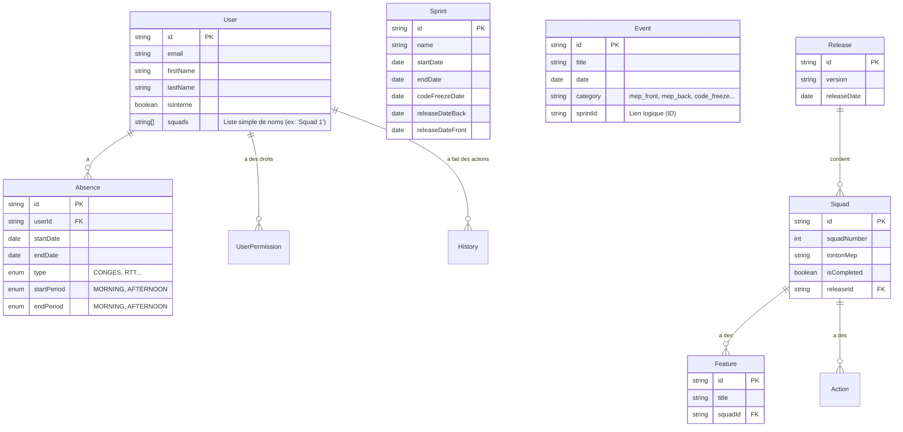

# Architecture & Documentation Fonctionnelle

Ce document décrit l'architecture technique et fonctionnelle de l'application **Ma Banque Tools**.

## Modèle de Données (ERD)

Diagramme des relations entre les entités principales de la base de données.

## Règles Métier Clés & Fonctionnalités

### 1. Gestion des Absences
Cette fonctionnalité permet aux collaborateurs de déclarer leurs congés et aux managers de visualiser la disponibilité des équipes.
*   **Filtrage Avancé** : L'interface permet d'appliquer des filtres multiples (par squad, métier, etc.) pour affiner la vue et cibler des groupes spécifiques.
*   **Vue Détaillée** : Un bouton "Afficher plus de détail" est disponible pour expandre les informations et visualiser le contexte complet des absences.
*   **Action Rapide** : Il est possible de **copier la liste des emails** des collaborateurs affichés directement depuis l'en-tête de la colonne EMAIL, facilitant la communication de groupe.
*   **Contexte Temporel** : Les **Sprints** sont reflétés sur la timeline supérieure : leurs jalons principaux (MEP, Freeze) y sont visualisés pour permettre d'anticiper les impacts des absences sur les livraisons.

### 2. Gestion des Événements & Sprints
*   **Événements** :
    *   **CRUD Complet** : Les utilisateurs peuvent créer, modifier et supprimer des événements dans le calendrier.
    *   **Historique** : Chaque modification d'événement est tracée (qui a modifié quoi et quand), permettant un audit des changements.
    *   **Catégories** : Il est possible de créer et supprimer des catégories personnalisées pour organiser les événements.
*   **Sprints** :
    *   **Cycle de Vie** : La création et la gestion des dates des Sprints se font exclusivement depuis l'interface d'**Administration**.
    *   **Automatisme** : La création d'un Sprint génère automatiquement 3 événements cruciaux (Code Freeze, MEP Back, MEP Front) qui sont verrouillés.

### 3. Gestion des Squads & Releases
*   **Organisation** : Une `Release` regroupe le travail de plusieurs `Squads` (entités de suivi). Notez que `User.squads` est une préférence d'affichage distincte de l'entité technique `Squad`.
*   **Validation** : Le statut d'avancement d'une Squad (`isCompleted`) est calculé dynamiquement en fonction de la validation de toutes ses Features et Actions (Pre/Post MEP).

### 4. Sécurité & Permissions
*   **RBAC** : Droits gérés par module (`ABSENCE`, `ADMIN`, `EVENTS`...) avec niveaux `READ`, `WRITE`, `NONE`.
*   **Droit par défaut** : Par défaut, les nouveaux utilisateurs obtiennent actuellement un accès large (`WRITE` sur tous les modules, y compris `ADMIN`), ce qui est un point d'attention pour la sécurité en production.

### 5. Accès & Compte Utilisateur
*   **Inscription** : L'inscription est autonome. Un utilisateur peut créer son propre compte à condition de posséder une adresse email professionnelle valide (format `prenom.nom@ca-ts.fr`).
*   **Sécurité** :
    *   **Autonomie** : Chaque utilisateur peut changer son mot de passe de manière autonome via son profil (Sidebar).
    *   **Réinitialisation** : En cas de perte d'accès, un **Administrateur** peut réinitialiser le mot de passe d'un utilisateur à sa valeur par défaut (`password`) depuis l'interface d'administration.

### 6. Administration
Module réservé aux utilisateurs disposant des permissions adéquates.
*   **Gestion des Sprints** : Création et configuration des cycles de sprints (dates de début/fin, freeze, MEPs).
*   **Gestion des Utilisateurs** :
    *   **CRUD** : Modification des informations, gestion des préférences.
    *   **Permissions** : Attribution fine des droits d'accès par module.
    *   **Suppression** : Possibilité de supprimer des comptes utilisateurs.
    *   **Réinitialisation MDP** : Fonctionnalité pour remettre le mot de passe d'un utilisateur à "password".
    *   **Maintenance** : Export/Import de la base de données et statistiques globales.

### 7. Playground
Module de Team Building ludique.
*   **Jeux** : Mise à disposition de mini-jeux pour favoriser la cohésion d'équipe.
*   **Classement** : Un système de scoring maintient un classement (leaderboard) basé sur les meilleures performances de chaque utilisateur.

## Stack Technique
*   **Backend** : Spring Boot 3+, Java 24
*   **Base de données** : MySQL
*   **Sécurité** : JWT (Json Web Tokens) / Spring Security
*   **API Doc** : OpenAPI 3 / Swagger (`/swagger-ui.html`)
